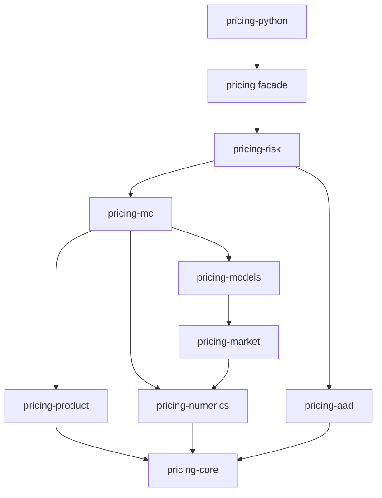
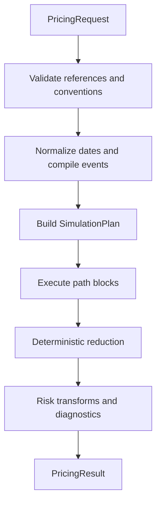

# Rust Derivatives Pricing Library — Architecture v0.1

Status: Initial architecture proposal; AAD execution boundary agreed
Date: 2026-09-03
Requirements baseline: `requirements-v1.0.md`
Initial implementation roadmap: `european-bs-roadmap-v0.1.md`

## 1. Architectural objective

The library shall expose a stable research-facing Rust and Python API while compiling user-friendly products and market objects into immutable, allocation-free execution plans for Monte Carlo, QMC, LSM, AAD, and VegaKT calculations.

The central boundary is:

\[
\text{validated domain objects}
\longrightarrow
\text{compiled pricing plan}
\longrightarrow
\text{parallel numerical kernels}
\longrightarrow
\text{structured result}.
\]

Dates, strings, maps, Python objects, dynamic graph nodes, and validation logic belong before the compilation boundary. Hot path loops shall operate on normalized times, stable integer identifiers, contiguous numeric buffers, and compiled opcodes.

## 2. Architectural principles

1. **Dependency direction is one-way.** Numerical and domain foundations do not depend on pricing engines or Python.
2. **Domain APIs and execution APIs are distinct.** Public objects optimize for clarity; compiled objects optimize for speed and deterministic replay.
3. **Dynamic dispatch stays outside path loops.** Runtime choices are resolved before execution into concrete kernels or compact enum variants.
4. **AAD is an execution capability, not a public scalar type.** Users pass ordinary `f64` market data; the risk engine decides which values are active.
5. **Randomness is addressable.** Pseudo-random and randomized-QMC inputs are indexed by deterministic path/dimension identities.
6. **Price-only execution does not pay for AAD.** Adjoint buffers, checkpoints, and reverse-only caches are enabled only by a risk request.
7. **Diagnostics are first-class outputs.** Numerical policies, warnings, seeds, schemes, smoothing, clamping, and estimator metadata are returned structurally.
8. **Python is an adapter.** All validation and pricing semantics live in Rust and are shared by both APIs.

## 3. Cargo workspace

| Crate | Responsibility | Direct internal dependencies |
| --- | --- | --- |
| `pricing-core` | IDs, dates/times, currency, typed errors, configuration metadata, result primitives | none |
| `pricing-numerics` | interpolation, matrix utilities, QR, correlation checks, deterministic reduction | `pricing-core` |
| `pricing-aad` | adjoint buffers, configurable fixed-interval checkpoints, reverse-kernel contracts | `pricing-core`, `pricing-numerics` |
| `pricing-market` | curves, forwards, dividends, SSVI/eSSVI, Dupire, Local variance grids | `pricing-core`, `pricing-numerics` |
| `pricing-product` | built-in products, Event/Payoff graph, graph validation and compilation | `pricing-core` |
| `pricing-models` | Black–Scholes, Black-76, Local Vol path kernels | `pricing-core`, `pricing-market`, `pricing-numerics` |
| `pricing-mc` | time-grid construction, RNG/QMC mapping, path blocks, payoff execution, LSM | `pricing-core`, `pricing-numerics`, `pricing-product`, `pricing-market`, `pricing-models`; optional `pricing-aad` |
| `pricing-risk` | AAD orchestration, bump/revalue, Gamma, smoothing policy, Local Vega, VegaKT | all Rust pricing crates |
| `pricing` | stable facade and convenient builders; re-exports supported public API | market, product, models, MC, risk |
| `pricing-python` | PyO3 classes, NumPy conversion, exception mapping, wheel module | `pricing` |

The facade crate is the supported Rust entry point. Lower-level crates may initially remain private workspace implementation details even when compiled as separate crates.



No dependency may point upward in this graph. In particular, market and product crates must not depend on an engine, and no Rust crate may depend on `pricing-python`.

## 4. Request lifecycle



### 4.1 Public request

```rust
pub struct PricingRequest {
    pub valuation_date: Date,
    pub product: ProductSpec,
    pub market: MarketContext,
    pub model: ModelSpec,
    pub engine: EngineConfig,
    pub risk: RiskRequest,
}

pub fn evaluate(request: &PricingRequest) -> Result<PricingResult, PricingError>;
```

`PricingRequest` owns or shares immutable domain data. Its public persisted representation is versioned UTF-8 JSON and contains no Python-specific or compiled runtime objects.

### 4.2 Compilation result

```rust
pub struct PricingPlan {
    pub market: CompiledMarket,
    pub product: CompiledProduct,
    pub simulation: SimulationPlan,
    pub risk: CompiledRiskPlan,
    pub fingerprint: PlanFingerprint,
}

pub trait PlanCompiler {
    fn compile(&self, request: &PricingRequest)
        -> Result<PricingPlan, ValidationErrors>;
}
```

Compilation performs all cross-object checks: currency identity, underlying ordering, required observations, correlation availability, date normalization, curve coverage, SSVI/eSSVI validity, Local variance construction, smoothing configuration, and risk convention selection.

The plan fingerprint shall be derived from semantically relevant normalized inputs and library version. It identifies a replayable calculation but shall not be used as a cryptographic authenticity claim.

### 4.3 JSON schema and migration boundary

The facade serializes `PricingRequest` and `PricingResult` as top-level JSON objects containing a stable string `document_kind` and unsigned integer `schema_version`. Schema types use strict unknown-field rejection recursively. The parser additionally rejects duplicate member names, comments, invalid UTF-8, and any non-whitespace trailing bytes. Typed errors retain a JSON Pointer-like path, declared schema version, and document kind. The writer emits struct fields in schema order and domain maps in their specified deterministic key order; raw JSON text is never itself the Plan fingerprint input.

`SchemaVersion` is a checked newtype over `NonZeroU32`; JSON zero, negative values, and values above `u32::MAX` are rejected before registry lookup. A single `CURRENT_SCHEMA_VERSION` covers all public document kinds and advances monotonically without reuse. Compatibility tables associate accepted Schema versions with the Rust crate's semantic major release. All serializers stamp `CURRENT_SCHEMA_VERSION`; no caller option can request historical output.

The JSON `f64` adapter accepts only finite numeric tokens and emits a versioned shortest-round-trip decimal representation whose parse recovers the same `to_bits()`. It special-cases the negative-zero bit pattern to the token `-0.0`. It never accepts or emits `NaN`, `Infinity`, `-Infinity`, quoted numeric sentinels, or `null` for an `f64`. Golden serializer fixtures pin exponent spelling, decimal point rules, signed zero, subnormals, and boundary finite values independently on both supported platforms.

All public schema enums use an internally tagged object. The reserved first output field is `"type"`, followed by variant payload fields in schema order; a unit variant is still encoded as `{ "type": "variant_tag" }`. Stable snake-case tag strings are declared by the JSON schema rather than derived from Rust type names. Strict variant visitors reject absent, duplicate, non-string, and unknown tags before constructing domain objects.

Wire field names, enum tags, and document-kind strings satisfy `^[a-z][a-z0-9_]*$`. Serde-facing names are declared explicitly and tested; Rust renames or Python aliases do not create accepted JSON aliases. The parser performs byte-exact matching against the versioned ASCII name and rejects case, hyphen, Unicode-lookalike, and undocumented legacy variants unless a registered old-schema migration owns them.

Schema `Option<T>` uses omission only. Serialization skips `None`; deserialization rejects a present `null` before invoking the `T` visitor. Required fields reject both omission and `null`. Defaults introduced by a migration are inserted by that explicit migration and are recorded in its fixtures; the current-schema parser does not silently synthesize a value from `null`. Semantically nullable domain states use a named internally tagged enum variant.

Integer visitors inspect the JSON number token as an integer lexical form and parse its decimal digits directly into the declared Rust width with checked arithmetic. A decimal point, exponent, quoted number, overflow, negative unsigned value, or unsigned `-0` is rejected with the field path and expected range. Serialization emits minimal base-10 integer tokens: `0` for unsigned zero, an optional leading minus only for negative signed values, and no plus sign, exponent, fractional part, or redundant leading zero.

`Map<String, V>`-shaped schema fields serialize as JSON objects. Maps keyed by dates, IDs, tuples, enums, or other non-string domain types serialize as arrays of `{ "key": ..., "value": ... }` entries; no display/debug/string conversion is used to manufacture object keys. Deserialization inserts with duplicate detection after full key normalization, so lexically distinct entries that normalize to the same domain key are also rejected. Every map adapter owns a documented deterministic comparator used only for output ordering.

The string-key comparator performs unsigned lexicographic comparison over `str::as_bytes()` and therefore applies no locale collation or Unicode normalization. A non-string key adapter first writes the key alone through the same type-tagged, length-framed, big-endian canonical encoder used by fingerprints, then sorts entries by unsigned lexicographic comparison of those bytes. Sorting is stable only as an implementation detail: duplicate byte encodings for unequal normalized keys return `SerializationError::NonInjectiveKeyEncoding`, while equal logical keys are rejected as duplicates.

The default serializer uses the compact formatter and emits no whitespace between JSON tokens beyond whitespace contained inside string values. `to_pretty_json` is a presentation helper over the same ordered serialization path, not an independently configured serializer; it may add indentation and line breaks but cannot change field order, entry order, number formatting, or semantics. Neither representation participates as raw bytes in the normalized plan or graph fingerprint.

The string formatter writes Unicode scalar values as their original UTF-8 bytes except where JSON requires escaping. It emits `\"` and `\\`, uses `\b`, `\t`, `\n`, `\f`, and `\r` for the five named controls, and emits every other U+0000--U+001F code point as lowercase `\u00xx`; it does not escape `/`, U+2028, U+2029, or other non-ASCII scalars. Golden fixtures pin every escape case and verify that Rust and Python-facing serialization produce identical bytes.

`to_pretty_json` uses a fixed formatter with two `0x20` bytes per indentation level, no tabs, and LF structural newlines. File-writing wrappers append the same single final LF used by compact output. A differently indented diagnostic rendering may be built by an application, but it is not the library's versioned pretty helper and is not used for golden serialization fixtures.

Deserialization is intentionally lexical-form tolerant but schema strict. The parser accepts RFC-compatible insignificant whitespace, any object-member order, and equivalent legal escape spellings, then constructs the version-declared typed object through duplicate-aware visitors. Schema validation, deterministic migration, and domain normalization run before fingerprinting. No raw-input slice, member order, whitespace, or escape spelling contributes to object identity; serializing the result always uses the current canonical writer.

The string visitor decodes literal UTF-8 and JSON Unicode escapes to Rust Unicode scalar values without normalization, case conversion, trimming, or locale processing. A valid surrogate pair in escape form becomes its single scalar value; isolated high or low surrogates, malformed escapes, and invalid UTF-8 fail before domain construction. Exact scalar sequences flow unchanged into string validation, UTF-8 map ordering, serialization, and canonical fingerprint framing.

`JsonReadLimits` contains versioned defaults and per-field absolute caps for input bytes, nesting depth, maximum decoded string bytes, number-token bytes, elements per array, members per object, and total value nodes. The streaming parser charges limits before allocation or recursive descent and uses checked counters. A caller-supplied override is validated field by field against the hard caps and may always reduce a default; requesting above a cap is an error rather than silent clamping. `SerializationError::ResourceLimitExceeded` reports the JSON path when known, limit name, effective maximum, and safely computed observed count. Effective non-default limits are retained in valuation replay metadata.

Release artifacts include one Draft 2020-12 JSON Schema per `(schema_version, document_kind)`, with stable `$id` values and local `$ref` resolution so validation requires no network access. Objects use explicit properties and `unevaluatedProperties: false` where composition requires it; internally tagged variants are represented as discriminated `oneOf` branches. Build tests validate positive and negative golden fixtures against both the bundled schema and Rust visitors, and fail on an unreviewed schema diff. Cross-field, calendar, graph, market, and numerical constraints remain authoritative Rust domain validation rules and are documented as such.

Each supported version has dedicated serde-facing wire DTOs. A deterministic generator derives the corresponding Draft 2020-12 documents from those DTOs plus explicit schema annotations; it does not inspect mutable runtime state or current-domain defaults. Generated schemas are checked in as byte-for-byte Golden files. CI regenerates them and requires an empty diff, while an intentional diff must be reviewed with compatibility fixtures, migration coverage, and the declared schema-version decision.

`ValidationIssue.instance_path` is an RFC 6901 JSON Pointer built from decoded member names and zero-based array indices, escaping pointer tokens with `~0` and `~1`; the root is `""`. Each issue also carries `code`, `schema_version`, `document_kind`, and `phase` (`declared_schema`, `migration`, `current_schema`, or `domain`). Migration failures retain the source pointer when available and explicitly label source and target versions; generated target-side errors use the target document pointer rather than pretending to reference original bytes.

Recoverable schema and domain validators feed issues into a bounded deterministic collector. Ordering is by validation phase, unsigned UTF-8 byte order of the RFC 6901 pointer, stable error code, and deterministic discovery ordinal for otherwise equal entries. The collector retains at most `max_validation_errors`, whose versioned default may be overridden only up to an absolute cap, and sets `truncated = true` as soon as an additional issue is observed. Fatal syntax, UTF-8, depth, allocation-prevention, and other parser-limit failures return immediately as a single fatal issue. Frozen invalid fixtures pin issue ordering, cap behavior, and truncation across supported platforms.

The decode pipeline is `syntax_and_limits -> declared_schema -> migration_step -> step_target_schema -> ... -> current_schema -> domain`. Each arrow advances only after the preceding phase has no errors; a migration never receives a document that failed its declared Schema. For a current-version document, `declared_schema` already is `current_schema`, so that Schema is evaluated once before `domain`. Phase and source/target schema versions are retained in every issue and in successful migration replay metadata.

`JsonReadLimits::default_for(schema_version)` sets `max_validation_errors = 64`. Overrides accept only positive integers and are rejected above the separately versioned absolute cap; no implicit clamping occurs. Recoverable validators share one effective 64-entry budget across Schema and domain phases, while an unrecoverable parser error is returned as the sole fatal issue because no trustworthy typed tree exists to continue validating.

File helpers write serializer bytes as BOM-free UTF-8 and append exactly one `\n` after the complete top-level value. Pretty output also normalizes all structural newlines to LF. Input rejects an initial UTF-8 BOM, decodes strictly as UTF-8, and permits JSON whitespace after the value while continuing to reject any trailing non-whitespace token. Tests pin the absence of CRLF and BOM and the presence of one writer-produced final LF on macOS and Windows.

`DenseArray<T>` serializes as `{ "shape": [d0, ..., dn], "data": [x0, ..., xm] }`. `data` is flat C/row-major storage with the final logical axis contiguous. Deserialization uses checked multiplication for the dimension product, requires equality with `data.len()`, then applies Graph/domain byte limits before allocation or conversion to `usize`. Nested/ragged arrays and alternate storage orders are not accepted under the same schema. Domain wrappers carry axis labels, dates, strike/maturity coordinates, and units explicitly, so `shape` alone never supplies financial semantics.

Only Source/domain objects cross this boundary. `PricingPlan`, `CompiledProduct`, Payoff opcodes, cache offsets, native-width indices, aligned buffers, and function dispatch state are rebuilt after deserialization and cannot be injected through JSON.

`SchemaMigrationRegistry` contains explicitly supported single-step functions identified by stable migration IDs. The reader validates version $v$ with the version-$v$ schema, applies the registered pure migration $v\rightarrow v+1$, validates the result, and repeats until the current version. Migration functions receive only the parsed document and use no time, environment, host, randomness, or I/O. A version above current or a gap in the chain returns `SerializationError::UnsupportedSchemaVersion`. Replay metadata carries original/current versions, ordered migration IDs, and BLAKE3 fingerprints before and after migration. Frozen JSON fixtures test every supported step and complete chain.

The registry retains a complete forward path from every Schema version released within the current library major to the current wire DTO for each document kind. Release metadata contains a generated compatibility matrix, and CI exercises every matrix source version through its full chain. Removing a source version is prohibited in a patch or minor library release and requires a new library major plus an explicit breaking-change record.

The registry is a directed acyclic forward chain whose public target is always `CURRENT_SCHEMA_VERSION`. Internal adjacent steps may be composed, but no reverse edge, historical writer, or arbitrary source-to-source conversion is part of the core API. After successful migration, serialization operates only on the current wire DTO and cannot preserve an old document's lexical or structural form.

Each migration returns `Result<TargetWireDto, MigrationError>` and must establish semantic equivalence under documented invariants. Missing or ambiguous economic fields, changed event meaning, unsupported numerical conventions, or any transformation requiring a policy choice returns `MigrationError::LossOfSemantics` with source/target versions and an RFC 6901 source pointer when available. Migration code cannot source a runtime default or downgrade the condition to a warning. Canonical renaming, explicit unit-preserving conversion, and structure-only rewrites are allowed when Golden fixtures prove equivalent normalized fingerprints or a documented version-aware equivalence relation.

The PyO3 boundary maps a recoverable Rust validation report to one Python `ValidationError`. Its `.issues` member is a newly owned Python list in Rust order; issue entries expose `code`, `instance_path`, `phase`, `schema_version`, `document_kind`, `message`, and optional migration-version fields. `str(error)` provides only a concise count and first-issue summary, while programmatic callers use `.issues`; construction is atomic and no invalid domain object is attached to the exception.

Python `ValidationIssue` instances are frozen extension objects with read-only getters and no writable `__dict__`. `to_dict()` allocates a fresh insertion-ordered dictionary in documented field order, recursively converts only public scalar/container values, and omits optional migration fields when absent. Equality compares the complete typed payload; application logic is expected to branch on `code`, not `message`.

Error-code constants are declared as stable lowercase ASCII `snake_case` wire identifiers and covered by Golden fixtures; changing or repurposing a code is a compatibility change. Messages are deterministic English diagnostics for a fixed release but remain informational. Generated Schema `$id` values come from a fixed URN constructor over `(schema_version, document_kind)` and all `$ref` targets use that local registry rather than network retrieval.

## 5. Core identities and data ownership

Use small newtypes rather than raw strings in execution code:

```rust
pub struct UnderlyingId(u32);
pub struct CurveId(u32);
pub struct CurrencyId(u16);
pub struct EventId(u32);
pub struct NodeId(u32);
pub struct TimeIndex(u32);
pub struct PathIndex(u64);
```

Public builders may accept names. Compilation interns and resolves names into stable indices. Compiled arrays use structure-of-arrays or dense row-major layouts selected for each kernel.

Large immutable market buffers may use `Arc<[f64]>`. Worker scratch space must be thread-local and reused across path blocks. A calculation must not mutate shared market or product objects.

### 5.1 Date normalization

Public domain objects use a date-only Rust type. Python adapters accept `datetime.date` or strict `YYYY-MM-DD` strings and convert them before building domain objects; time-of-day, timezone, and NumPy `datetime64` coercions are not part of the MVP.

`ACT/365F` and `ACT/360` are the only MVP day-count implementations. `ACT/365F` is the ergonomic default, but the normalized plan always records the selected convention and resulting year fractions.

The calendar implementation contains a Saturday/Sunday weekend rule and an immutable sorted custom-holiday set. It does not ship changing exchange-holiday databases. Schedule compilation, not path execution, applies calendar rules and retains source dates, adjusted dates, and calendar identity in replay metadata.

Schedule adjustment supports `Unadjusted`, `Following`, `ModifiedFollowing`, and `Preceding`. Compilation retains both the original and adjusted dates so that no business-day movement is hidden.

## 6. Market architecture

### 6.1 Curves and forwards

```rust
pub trait DiscountCurve: Send + Sync {
    fn discount(&self, t: f64) -> Result<f64, MarketError>;
    fn log_discount(&self, t: f64) -> Result<f64, MarketError>;
}

pub trait ForwardProvider: Send + Sync {
    fn forward(&self, underlying: UnderlyingId, t: f64)
        -> Result<f64, MarketError>;
}
```

Public traits are coarse-grained extension points. Standard log-linear discount curves and equity forwards compile to concrete internal representations. A trait-object call may occur while building a plan, but not once per simulated path.

The forward provider owns the single definition of forward used by SSVI/eSSVI, log-moneyness, drift construction, and risk conventions.

`CompiledDividendTransform` normalizes each ex-date event to `D_i(S) = alpha_i * S0 + beta_i * S`, while retaining the original fixed-cash or proportional quote. For `FixedCash(D_i)`, compilation sets `alpha_i=D_i/S0`; a Spot bump holds `D_i` fixed and recompiles `alpha_i`. It precomputes the deterministic affine coordinate map `S_t = A(t) * S0 + B(t) * f_t`. At an event, `A_after = (1-beta_i) * A_before - alpha_i` and `B_after = (1-beta_i) * B_before`; between events, the same carry convention used by `ForwardProvider` evolves `A` and `B`. This creates a state `f` that is continuous across dividend dates and is the canonical coordinate for Local Volatility and VegaKT kernels.

The implied-surface compiler accepts SSVI/eSSVI parameters and IV marks only in continuous-martingale `f` coordinates whenever discrete dividends are present and validates the call-price matching condition of SSRN 1885032. The `f` surface remains continuous and supplies its analytic maturity derivative through ex-dates. Contract call values and strikes are mapped through `S=A*S0+B*f`, but no market-Spot IV surface is inverted or reported. Direct SSVI/eSSVI input in Spot coordinates is not compiled in the MVP.

Discount curves use flat-forward extrapolation on both boundaries by extending the boundary slope of `log D(t)`. `D(0)=1` is a required anchor and negative query times are errors. The compiled curve records extrapolation counts and the minimum/maximum extrapolated times for diagnostics.

### 6.2 Implied variance surfaces

```rust
pub struct TotalVarianceDerivatives {
    pub w: f64,
    pub dw_dk: f64,
    pub d2w_dk2: f64,
    pub dw_dt: f64,
}

pub trait ImpliedVarianceSurface: Send + Sync {
    fn total_variance(&self, k: f64, t: f64)
        -> Result<TotalVarianceDerivatives, SurfaceError>;
}
```

`StandardSsvi` and `ExtendedSsvi` implement this interface and compile into an internal enum so the Dupire grid builder can dispatch outside its inner grid loops.

`StandardSsvi` owns a non-decreasing C1 PCHIP for `theta(T)` plus one global constant `rho` and one global `PhiSpec`. Only `theta` is maturity-interpolated. Its PCHIP derivative and analytic SSVI strike derivatives produce `TotalVarianceDerivatives`.

`PhiSpec` has two MVP variants: `PowerLaw { eta, gamma }`, implementing `eta / (theta^gamma * (1 + theta)^(1 - gamma))`, and `HestonLike { lambda }`, implementing `{1 - [1 - exp(-lambda*theta)]/(lambda*theta)} / (lambda*theta)`. Each variant exposes analytic theta derivatives, a stable small-theta branch, and admissibility validation over the compiled theta range.

`ExtendedSsvi` owns consistent knots `(T_i, theta_i, psi_i, rho_i*psi_i)`. Within a maturity bucket it linearly interpolates `theta`, `psi`, and `rho*psi`, then recovers `rho=(rho*psi)/psi`. This is a distinct arbitrage-preserving interpolation strategy rather than the Standard SSVI PCHIP reused component-wise.

Short-end eSSVI extrapolation scales `theta` and `psi` by `T/T_1` and holds `rho` fixed. Long-end extrapolation freezes `psi` and `rho` and grows `theta` linearly with an explicit non-negative terminal ATM forward-variance slope. Standard SSVI applies the analogous short/long `theta` extrapolation while retaining its global `rho` and `PhiSpec`.

### 6.3 Local variance

`LocalVarianceGrid` stores explicit time nodes, explicit `x=log(f/F_f(T))` nodes, row-major Local variance values, mandatory floor/cap values, and clamp diagnostics. It provides bilinear value interpolation and a separate reverse interpolation operation for Local Vega accumulation. Horizontal queries outside the grid use the nearest boundary value and update structured boundary-use diagnostics; linear wing extrapolation is not used.

Its builder rejects missing bounds and requires finite `0 < floor <= cap`. A separate `suggest_local_variance_nodes` helper evaluates distinct left/right analytic `f`-density quantiles at every requested maturity, takes their cross-maturity envelope, and adds distinct left/right log-moneyness paddings. It creates one rectangular non-uniform grid from two piecewise-sinh maps joined at an exact ATM node, with explicit side-specific node counts and shape parameters. The helper has no privileged execution path: its output is validated, stored, fingerprinted, and consumed exactly like manually supplied nodes.

The primal and reverse interpolation methods must use the same cell-selection and boundary conventions. Cell indices and weights may be cached per step/path block for the reverse pass.

### 6.4 Correlation term structure

The public term structure is an ordered sequence of `(effective_date, matrix)` entries. Compilation converts dates to year fractions, rejects duplicate or non-increasing normalized effective times, and inserts every change strictly inside the pricing horizon into the simulation grid. Selection is right-continuous: entry `j` owns `[t_j, t_{j+1})`; consequently the interval whose right endpoint is `t_j` uses entry `j - 1`, and the interval whose left endpoint is `t_j` uses entry `j`.

Compilation requires `max { j | t_j <= valuation_time }` to exist. That entry covers the first simulation interval, later entries take effect at their left endpoints, and the final entry is held flat through the last required simulation time. There is no implicit Identity fallback and no requirement for a redundant terminal entry. `CompiledMarket` stores, for each interval, the source entry index, normalized effective time, canonical-matrix fingerprint, and factorization reference; these mappings are included in replay diagnostics.

```rust
pub struct CorrelationToleranceConfig {
    pub symmetry_abs_tol: f64,
    pub diagonal_abs_tol: f64,
    pub psd_abs_tol: f64,
    pub psd_rel_tol: f64,
    pub zero_pivot_abs_tol: f64,
    pub zero_pivot_rel_tol: f64,
}
```

All six fields are mandatory, finite, and non-negative. The correlation compiler validates every period matrix in the one canonical underlying order and never pivots that order. It first rejects non-square shapes, mismatched dimensions, non-finite entries, and deviations from symmetry or unit diagonal beyond the configured checks.

For a raw matrix that passes those checks, compilation visits off-diagonal pairs in ascending `(i, j)` order with `i < j`, evaluates `avg = (raw[i,j] + raw[j,i]) * 0.5` in that operation order, and writes `avg` symmetrically. It then writes every diagonal element as the exact `f64` value `1.0`. Each canonical off-diagonal value is subsequently required to satisfy `-1.0 <= avg && avg <= 1.0`; failure returns `CorrelationOutOfBounds`, with no tolerance-based clamp. Compilation records maximum raw asymmetry, maximum raw diagonal deviation, maximum absolute canonicalization adjustment, and raw/canonical fingerprints. It never canonicalizes a deviation that failed its tolerance check.

The canonical matrix scale is

```rust
let scale = 1.0_f64.max(
    rows_in_ascending_order
        .map(|row| row.abs_values_in_ascending_column_order().fixed_sum())
        .max_by_total_order()
);
```

`fixed_sum` is a versioned, scalar, ascending-column `f64` accumulation and is not parallelized or delegated to BLAS. This implements `max(1, ||C||_infinity)` deterministically.

Let `scale` be the selected deterministic matrix scale, `tau_psd = max(psd_abs_tol, psd_rel_tol * scale)`, and `tau_zero = max(zero_pivot_abs_tol, zero_pivot_rel_tol * scale)`. The baseline factorizer is a scalar, unpivoted PSD-aware Cholesky in underlying-index order. At column `j`, it computes the Schur pivot and residuals with fixed loop order:

\[
p_j=C_{jj}-\sum_{k<j}L_{jk}^2,
\qquad
r_{ij}=C_{ij}-\sum_{k<j}L_{ik}L_{jk}\quad(i>j).
\]

- If `p_j > tau_zero`, set `L_jj = sqrt(p_j)` and calculate the lower-column entries normally.
- If `p_j < -tau_psd`, return `CorrelationNotPsd`.
- Otherwise classify the pivot as numerical zero. Require every `abs(r_ij) <= tau_zero`; if any fails, return `CorrelationSingularResidual`. A qualifying zero direction contributes no positive pivot and lowers numerical rank.

The stored factor is always a dense lower-triangular `n x n` matrix in underlying order. A qualifying zero pivot sets the entire corresponding factor column from its diagonal downward to exact zero. Columns are never removed, so the independent Brownian factor count and the bridge dimension layout remain `n` across all term-structure periods, including periods of different numerical rank.

No branch adds jitter, clips an eigenvalue, projects the matrix, changes underlying order, compresses the factor, or falls back to another decomposition. Compilation records `scale`, both effective thresholds, every raw pivot, zero-pivot indices, numerical rank, maximum checked residual, canonicalization diagnostics, and factorizer ABI.

## 7. Product architecture

### 7.1 Domain graph

The public graph builder is typed and composable. It produces immutable node specifications rather than executable closures.

Only the versioned Source graph belongs to the public serialized request. The compiled Payoff tape is an ephemeral, immutable derivative of that graph and is rebuilt after deserialization; native `usize` values, cache offsets, dispatch artifacts, and raw tape bytes are never deserialized as executable input. The compiler canonicalizes the Source graph, validates its schema version, and deterministically assigns event order, opcode order, state/value slots, and cache layout under a named compiler/tape ABI. `CompiledProduct` records a canonical Source-graph fingerprint and a logical-tape fingerprint plus both versions, allowing replay to detect compiler-policy changes without treating process-native tape bytes as portable storage.

Compilation uses Kahn's algorithm with a min-ordered Ready set keyed by the persisted Source `NodeId`. After emitting a node, the compiler visits its outgoing edges in ascending destination `NodeId` order before updating readiness. Duplicate Source IDs, dangling operands, cycles, a count above `u32::MAX`, or any slot/index assignment that cannot fit in `u32` produces a typed compile error before tape/workspace allocation. Hash iteration and pointer identity never participate in ordering.

The ordinary Rust/Python `GraphBuilder` owns `next_node_id: u32`, starts at zero, allocates with `checked_add`, and maintains a lifetime high-water mark. Removing or rolling back a node does not place its ID on a free list. When editing a deserialized Source graph, the builder preserves gaps and initializes the next ID from `max(existing_id) + 1`; the all-`u32`-space-exhausted case is `GraphBuildError::NodeIdExhausted`. Deserialization validates uniqueness without compacting or renumbering IDs.

Before allocating adjacency, tape, slot, cache, checkpoint, or workspace buffers, compilation evaluates a versioned `GraphLimitPolicy` with separate `max_source_nodes`, `max_compiled_opcodes`, `max_edges`, `max_outputs`, `max_events`, `max_value_slots`, `max_state_slots`, `max_reverse_cache_slots`, and `max_estimated_workspace_bytes` fields. Each field has a versioned default and optional request override. Source counts are checked before Dead-node elimination; Compiled-opcode and slot counts are checked after reachability, folding, and liveness layout. Workspace bytes are estimated from resolved tile capacity, padded SoA strides, checkpoint/event caches, requested risks, and configured worker count using checked `usize` arithmetic. Diagnostics record every input and subtotal. Soft-limit excess returns `GraphCompileError::ResourceLimitExceeded { field, observed, effective_limit }`; identifier overflow, byte-size overflow, or impossible platform allocation returns a separate hard-capacity error. No failure path clips counts or silently lowers the requested graph. Exact initial values remain numerical-policy data rather than constants scattered through kernels.

The result is logically equivalent to `Vec<PayoffOpcode>`, where `PayoffOpcode` is a closed Rust enum and every operand and result/cache reference is a `u32` newtype. Forward execution scans increasing opcode index and dispatches with an exhaustive `match`; reverse execution scans the live opcode indices in decreasing tape order and uses the same enum's matched reverse rule. The hot loop contains neither `dyn Trait` opcode dispatch nor caller-provided function pointers. At each buffer access, a logical ID is bounds-checked and converted to `usize`; the serialized graph and logical-tape fingerprint never contain native-width indices. Stable logical opcode tags belong to the tape ABI even though the compiler's in-memory enum layout does not.

Compiler optimization policy v1 performs no common-subexpression elimination. Even when two pure Source nodes have identical opcode and operands, they keep separate Source identity and separate source-to-compiled entries unless the Source graph explicitly points multiple consumers to the same `NodeId`. The compiler may eliminate unreachable work only under the separately defined output-liveness policy; it never infers sharing from structural equality.

Constant folding is limited to literal-only pure subgraphs. Nodes are evaluated in canonical Kahn order by the same scalar opcode helper used by runtime, preserving declared operand order, branch/smoothing semantics, and the global no-FMA/no-reassociation policy. Equal results are not interned. The source-to-compiled table records every folded Source node, its provenance, and its output's `f64::to_bits()` value; these entries participate in the logical-tape fingerprint even when no runtime opcode is emitted.

Source validation runs over the complete graph before output dead-code elimination. It checks all IDs/edges, types, event schedules/order, units/currencies, finite literals, cycles, and every eligible literal-only fold, including unreachable subgraphs. A fold checks `is_finite()` after each opcode; failure returns `GraphCompileError::NonFiniteConstantFold` with Source ID, stable opcode tag, ordered operand `to_bits()` values, and result bits. It never emits the non-finite literal and never converts the node back to a runtime opcode.

After whole-graph validation succeeds, reverse reachability starts from the explicitly declared Product output IDs. Unreachable nodes emit no runtime opcode and receive no runtime value, adjoint, or cache slot, but their canonical Source representation remains in the Source fingerprint. `CompiledProduct` stores the removed Source IDs in ascending order and incorporates that list into the logical-tape fingerprint and diagnostics.

The canonical fingerprint encoder is distinct from JSON or any other request/result wire format. Its v1 value frame is logically `[type_tag: u8][payload_len: u64_be][payload]`. Fixed-width integers use their declared width in big-endian order; `f64` payloads are eight big-endian bytes from `to_bits()`. Struct payloads contain fields in schema order as `[field_id: u32_be][value_frame]`. Sequence payloads begin with `count: u64_be` and then framed elements in canonical sequence order. Map entries are ordered lexicographically by each key's complete canonical encoded bytes and then encode framed key/value pairs. Options use distinct stable tags for absent and present, so omission cannot alias an explicit zero or empty value. Stable tags, field IDs, and framing version belong to the fingerprint ABI; Rust enum discriminants, padding, pointer values, and native object bytes never enter the stream.

String payloads are their exact UTF-8 bytes; `payload_len` is the UTF-8 byte count. No NFC/NFD normalization, case conversion, whitespace trimming, locale transform, or filesystem/path normalization is applied. Python conversion must fail on text that cannot produce valid UTF-8 for Rust. Domain-specific validation may reject invalid identifiers but accepted bytes are preserved exactly. Thus visually equivalent but byte-distinct strings intentionally remain distinct fingerprint inputs.

All configuration fingerprints use BLAKE3-256. The encoder begins each stream with a fixed ASCII domain label such as `pricing/source-graph`, `pricing/logical-tape`, or `pricing/plan`, followed by the applicable schema/ABI version in canonical integer encoding and then the framed payload. The 32 digest bytes are stored directly; display and Python conversion produce `blake3-256:` followed by exactly 64 lowercase hexadecimal digits. Hash algorithm ID, domain label, and version are replay metadata. The digest is an equality/replay identifier, not an authentication primitive.

The reverse executor scans live opcode indices from greatest to least. An opcode emits input-adjoint contributions in its declared operand-position order and immediately applies scalar `f64 +=` to the addressed SoA lane. Duplicate operands are therefore accumulated left-to-right by operand position. No atomic, per-slot compensation, contribution sorting, parallel fan-in, or fused multiply-add may change this sequence. The path contribution is handed to the separately specified Neumaier cross-path reduction only after the path's graph reverse is complete.

```rust
pub enum ValueType {
    Scalar,
    Boolean,
    Cashflow,
}

pub enum NodeSpec {
    Constant(f64),
    ObserveSpot { underlying: String, date: Date },
    Add(NodeId, NodeId),
    Multiply(NodeId, NodeId),
    Maximum(NodeId, NodeId),
    Minimum(NodeId, NodeId),
    Indicator { condition: NodeId, smoothing: IndicatorSmoothing },
    Digital { kind: DigitalKind, strike: NodeId, payout: NodeId },
    Pay { amount: NodeId, date: Date, currency: String },
    // Additional state and event nodes.
}
```

`DigitalKind` covers cash-or-nothing and asset-or-nothing Calls and Puts. `IndicatorSmoothing` carries an explicit fixed positive `half_width` in the node's native units and selects the MVP compact C2 quintic kernel. For signed condition `x`, the transition band is `[-half_width, half_width]` and its interior coordinate is `u = (x + half_width) / (2 * half_width)`. `Maximum` and `Minimum` compile to a paired compact polynomial based on the integral of that kernel, remain exact outside the smoothing band, and share explicit primal and reverse rules. The compiler may specialize unsmoothed price-only opcodes, but a smoothed Price/AAD request uses exactly the same smoothed opcode program for both outputs.

An optional `WidthLadder` contains an ordered, non-empty list of positive half-widths plus one separately identified primary half-width. Compilation produces one immutable plan per ladder entry. Execution reuses the same logical random coordinates and reduction partitioning but does not share or interpolate payoff results between widths. The result contains a separately labelled Price/Greek record for every half-width and adjacent-width differences; it performs no adaptive selection or zero-width extrapolation.

Standard Asian and Lookback builders are thin, validated front ends to this graph rather than separate pricing engines. Their domain layer uses structures equivalent to:

```rust
pub struct WeightedObservation {
    pub date: Date,
    pub weight: f64,
    pub fixing: FixingState,
}

pub enum FixingState {
    Known(f64),
    Unknown,
}

pub enum AveragePriceSide { Call, Put }
pub enum FixedLookbackSide { Call, Put }

pub enum HistoricalExtremum {
    None,
    RunningMaximum(f64),
    RunningMinimum(f64),
}
```

An arithmetic average-price option validates `abs(sum(weights) - 1)` against a versioned tolerance and never renormalizes user input. It compiles each unknown scheduled observation to `ObserveSpot`, folds known fixings into deterministic accumulator contributions, and emits the weighted sum and positive-part payoff. Dates before valuation require `Known`; dates after valuation require `Unknown`; valuation-date observations retain the caller's mandatory explicit choice.

A fixed-strike Lookback Call compiles its declared discrete observations to a running Maximum state initialized from `RunningMaximum` when past monitoring exists; a Put analogously uses Minimum and `RunningMinimum`. The opposite extremum variant, a missing required historical extremum, or an extremum supplied when no past declared monitoring exists is rejected. No Spot is inserted merely because it is the initial, valuation-date, or trade-start value. The compiler inserts only declared monitoring observations, adds no intermediate points, and applies no continuous-extremum correction. Both products use the common C2-smoothed positive-part opcode for the primary smoothed Price/AAD request and preserve their exact payoff opcodes for explicitly requested contractual-price diagnostics.

Compilation resolves schedule dates before allocating accumulator or extremum state slots. Observations on dividend ex-dates are placed in the post-jump phase. Product-specific builders validate that every known fixing belongs to the declared schedule and emit only generic typed graph nodes and state updates, so MC, QMC, AAD, reduction, and replay logic remain shared.

Known fixings and historical extrema compile into constant slots tagged `ContractualState`. Risk compilation never seeds adjoints for those slots and never includes them in a market bump set. Recompiled bump valuations copy their values byte-for-byte, while result metadata fingerprints the values as part of the product rather than the market snapshot.

Basket and Worst-of builders similarly lower into generic graph operations. Their domain components are equivalent to:

```rust
pub struct BasketComponent {
    pub underlying: UnderlyingName,
    pub weight: f64,
    pub scale: PositiveFinite,
}

pub struct WorstOfComponent {
    pub underlying: UnderlyingName,
    pub reference_level: PositiveFinite,
}

pub enum MultiAssetOptionSide { Call, Put }
```

The Basket compiler emits `weight * ObserveSpot / scale` for each component followed by a deterministic-order sum. It validates only finiteness of weights and therefore preserves signed weights and arbitrary sums byte-for-byte; no normalization branch exists. `scale=1` gives a Raw-Spot component, while any other explicit contractual scale can encode Performance or another intentional unit conversion.

The Worst-of compiler emits `ObserveSpot / reference_level` followed by the common Minimum reduction in resolved underlying order. Its primary Price/AAD plan uses the configured compact C2 Minimum rule and its exact diagnostic plan uses the exact Minimum opcode. Scales and reference levels compile into `ContractualState` constants and are not sourced from `CompiledMarket`. Risk compilation neither seeds their adjoints nor rewrites them during any bumped plan compilation. Validation rejects duplicate component underlyings before resolving the component order against the model and correlation layouts.

The standard Basket-option and Worst-of-option builders append the common fixed-strike Call or Put positive-part opcode and a dated payment node to their aggregate observable. They do not introduce separate payoff kernels. This keeps smoothing, AAD, bump validation, cash-flow discounting, and diagnostics identical to the equivalent user-built graph.

The standard Autocallable builder owns a Worst-of component set and an ordered array of observation records equivalent to:

```rust
pub struct AutocallObservation {
    pub observation_date: Date,
    pub call_barrier: PositiveFinite,
    pub call_redemption: f64,
    pub call_coupon: f64,
    pub call_payment_date: Date,
    pub conditional_coupon: Option<ConditionalCoupon>,
}

pub struct ConditionalCoupon {
    pub barrier: PositiveFinite,
    pub amount: f64,
    pub payment_date: Date,
}

pub enum CouponMemoryMode { NoMemory, Memory }

pub enum MemoryTerminationAction { Release, Forfeit }

pub struct MemoryTerminationPolicy {
    pub on_autocall: MemoryTerminationAction,
    pub on_maturity: MemoryTerminationAction,
}

pub struct MaturityRedemption {
    pub final_barrier: PositiveFinite,
    pub notional: PositiveFinite,
    pub payment_date: Date,
}

pub struct ActiveAutocallSnapshot {
    pub unpaid_memory_coupon: NonNegativeFinite,
    pub determined_unpaid_cashflows: Box<[DeterminedCashflow]>,
}

pub enum ValuationDateObservation {
    Known { worst_of: PositiveFinite },
    Unknown,
}
```

Compilation computes one Worst-of Performance observable per observation date, applies independent call and coupon indicator nodes, and emits dated cash flows. Call barrier arrays receive no monotonicity check. The no-memory program discards a failed coupon immediately. The memory program adds the missed observation's nominal amount to a preallocated `unpaid_coupon` path-state slot without discount accumulation; a successful coupon emits `unpaid_coupon + current_coupon` and resets that slot to zero.

Within a shared observation event, opcodes are ordered as: observe Worst-of; evaluate coupon; update/release Memory state; emit the conditional coupon cash flow; evaluate call; apply `on_autocall` to any remaining Memory balance; emit the call coupon and redemption; set terminal state. The terminal state masks every later observation and cash flow.

If still active at maturity, the program observes Worst-of once and branches between `notional` for `W >= final_barrier` and `notional * W` below it, then applies `on_maturity` to the remaining Memory balance. Exact mode uses inclusive comparison. Smoothed mode uses the common quintic indicator to blend the two redemption branches and differentiates the blend and downside amount. No earlier event reads or updates final-barrier state. Indicator smoothing and reverse rules are the common graph implementations rather than Autocall-specific math.

Compilation initializes the Memory slot from `ActiveAutocallSnapshot` and emits its determined unpaid cash flows directly into the compiled cash-flow list. Their amounts are `ContractualState` constants, but their discount-factor lookups remain differentiable market operations. Past observations are validated against and then removed from the executable schedule. A valuation-date observation must carry `ValuationDateObservation`; `Known` compiles to a fixed Worst-of slot and `Unknown` to the normal time-zero observation opcode.

Call and coupon comparison opcodes use inclusive `W >= barrier` in exact mode. Smoothed mode passes signed distance `W - barrier` through the common quintic indicator, so equality maps to one half and its adjoint follows the shared indicator reverse rule.

### 7.2 Compiled product

Compilation converts graph nodes into typed opcode arrays grouped by event time and execution phase:

1. pre-model-jump observations;
2. market/model jumps such as dividends;
3. post-jump observations;
4. state updates and barrier/call decisions;
5. cash-flow creation; and
6. payment discounting.

Same-time ordering is therefore explicit rather than inherited from container insertion order.

```rust
pub struct CompiledProduct {
    pub event_programs: Box<[EventProgram]>,
    pub scalar_slots: usize,
    pub boolean_slots: usize,
    pub state_slots: usize,
    pub required_observables: Box<[ObservableKey]>,
}
```

The opcode interpreter may later be replaced by generated or specialized kernels without changing the public graph.

## 8. Model and path-kernel architecture

`ModelSpec` is a serializable public enum. It compiles into one concrete kernel selection before paths are evaluated.

```rust
pub enum ModelSpec {
    BlackScholes(BlackScholesSpec),
    Black76(Black76Spec),
    LocalVol(LocalVolSpec),
}

pub trait PathKernel: Send + Sync {
    type State;

    fn initialize(&self, path: PathIndex, state: &mut Self::State);
    fn evolve(
        &self,
        step: StepContext,
        normals: &[f64],
        state: &mut Self::State,
        cache: &mut StepCache,
    ) -> Result<(), SimulationError>;
}
```

The actual executor is generic over the selected kernel; it does not use `dyn PathKernel` inside the path/step loop. Each concrete model supplies matched primal and adjoint operations. Exact Black–Scholes/Black-76 and Log-Euler Local Vol therefore share the execution protocol without sharing a scalar-level operator tape.

The effective design is a coarse-grained hybrid similar in spirit to tensor AD systems:

- the compiled model/payoff program is an operation graph;
- every model step and payoff opcode owns an explicit reverse rule;
- graph construction and execution-mode selection happen outside the hot loop; and
- scalar operations inside a path step are never appended to a general-purpose tape.

This preserves composability at kernel/opcode granularity while avoiding a tape proportional to `paths × time_steps × scalar_operations`.

Cash and proportional dividends compile to one affine event operation, `S_after = (1-beta) * S_before - alpha * S0`, equivalent to proportional-then-cash ordering. The Local Volatility kernel simulates only the continuous state `f` and materializes `S=A*S0+B*f` at contractual and diagnostic observations. An ex-date updates deterministic `A` and `B`, not the simulated state. A non-positive reconstructed post-dividend Spot immediately returns the required typed error with deterministic path and event identity.

Expiry observations colliding with an ex-date are always compiled into the post-jump observation phase. The MVP does not expose a product-level override for this ordering.

For continuous barrier correction, compilation transforms each Spot barrier to `H_f(t) = (H_S(t) - A(t)*S0) / B(t)` and validates positivity over every monitored interval. The path kernel applies its bridge formula in `log(f)` using a linearly interpolated `log(H_f)`, both transformed-barrier endpoints, and effective interval variance `0.5 * (local_var_start + local_var_end) * dt`. With two safe endpoints it carries the analytic conditional survival probability as a path weight; it consumes no extra uniform coordinate. Products of survival terms use stable log-domain accumulation. Dividend events bypass the diffusion bridge and consume no random variate.

Barrier opcodes expose exact and smoothed hit modes. Exact mode preserves inclusive touch-is-hit semantics. Smoothed Price/AAD mode evaluates every discrete endpoint with the compact C2 quintic indicator at an explicit Spot-distance half-width. For a dividend event it computes pre- and post-jump signed hit distances and combines them with the same C2 smoothed `Maximum` opcode before applying the quintic indicator. This represents a deterministic jump crossing as a differentiable hit weight without reclassifying it as bridge crossing. Barrier diagnostics count endpoint, weighted bridge, and dividend-jump contributions separately and record the mode and half-width.

The barrier opcode owns an explicit reverse rule through both endpoint states, both Local-variance lookups, the trapezoidal variance, the transformed barrier endpoints, and stable survival-probability branches. The validation bump recompiles these same quantities; it does not freeze the base crossing probability.

`BarrierSpec` is inclusive-on-touch and supports `UpIn`, `UpOut`, `DownIn`, and `DownOut` with one level schedule. Its rebate is either absent or fixed cash payable at expiry. Compiled branch opcodes consume survival weight for no-hit branches and its complement for hit/activation branches. No opcode requests a first-passage time in the MVP; double barriers, multi-level windows, and hit-time-paid rebates require later estimator extensions.

## 9. Random source and SimulationPlan

Pseudo-MC and RQMC share a logical coordinate system:

```rust
pub struct SampleCoordinate {
    pub replicate: u32,
    pub path: u64,
    pub dimension: u64,
    pub domain: u32,
}

pub trait UniformSource: Send + Sync {
    fn uniform(&self, coordinate: SampleCoordinate) -> f64;
}
```

The pseudo-random implementation uses **Philox4x32-10** with word ABI version `philox4x32-10/coord-v1`. For master seed `seed: u64`, the key is constructed by unsigned shifts and masks, never by transmuting host bytes:

```rust
let key = [seed as u32, (seed >> 32) as u32];
```

For `path: u64`, global logical `dimension: u64`, and `domain: u32`, counter packing and lane selection are:

```rust
if dimension >= (1_u64 << 34) {
    return Err(SimulationError::RandomDimensionOutOfRange { dimension });
}
let counter = [
    path as u32,
    (path >> 32) as u32,
    (dimension >> 2) as u32,
    domain,
];
let lane = (dimension & 3) as usize;
let word = philox4x32_10(counter, key)[lane];
```

Thus one counter evaluation supplies four consecutive global dimensions for one path. The Philox core uses explicit wrapping `u32` multiply/add/XOR semantics, so this integer result is invariant to host endianness and CPU architecture. Implementations may cache the four-word result within a path kernel, but caching must be observationally identical to independently addressing every coordinate.

`SimulationPlan` owns the deterministic mapping from logical driver coordinates to `dimension`. It first fixes the normalized step order, factor order, auxiliary-driver order, and Brownian-bridge permutation, then assigns a dense zero-based global dimension. Neither product graph shape nor runtime traversal order is encoded or hashed into the Philox counter. The plan validates the $2^{34}$ dimension ceiling before execution.

`domain` selects an explicit substream from registry version 1:

```rust
#[repr(u32)]
pub enum RandomDomain {
    Valuation = 0,
    LsmTrain = 1,
    RqmcScramble = 2,
    Diagnostics = 3,
}
```

Base valuation, AAD replay, and common-random-number bumps use `Valuation`. LSM policy fitting uses `LsmTrain`. The Philox words used to construct RQMC LMS matrices and digital shifts use `RqmcScramble`; Sobol point coordinates themselves remain governed by the RQMC coordinate contract. Standalone numerical tests and diagnostic simulations use `Diagnostics`. Raw values absent from the selected registry version are invalid. Registry version and domains used are replay metadata, and no caller-visible label is hashed into this word.

Conformance tests include published Philox4x32-10 vectors plus coordinate-ABI vectors for both seed words, both path words, all four lanes, all four registry-v1 domains, path boundaries, and dimensions `0`, `3`, `4`, and $2^{34}-1$. These vectors are shared by the Rust and Python API tests.

A Philox word is converted to an open-interval `f64` with the versioned midpoint mapping:

```rust
const INV_TWO_POW_32: f64 = 1.0 / 4_294_967_296.0;
let u = (f64::from(word) + 0.5) * INV_TWO_POW_32;
```

The cast, addition, and multiplication order is normative. Since the scale is an exact power of two, the range is exactly $2^{-33}\le u\le1-2^{-33}$. One logical uniform consumes one Philox word and therefore one lane.

The Sobol implementation embeds all 21,201 dimensions of the **Joe–Kuo 6.21201** direction-number set and maps point index and zero-based internal dimension `0..21_201` to a 32-bit word. The embedded asset has a fixed format version and build-time checksum; compilation rejects an effective dimension above 21,201.

Each replicate applies an independent **linear matrix scramble (LMS) plus digital shift** for every used dimension. Both are generated independently for each `(replicate, dimension)` pair from the master scramble seed; no matrix or shift is reused across either axis. The resulting scrambled `u32` uses the identical midpoint conversion shown above. RQMC uses **16 independent scrambles by default**. The number of scrambles remains configurable and is recorded in estimator and replay metadata.

For word bit access, `bit(0)` means the MSB and `bit(31)` the LSB. Each LMS matrix $L$ is represented by 32 `u32` row masks and satisfies

\[
L_{r,c}=0\quad(c>r),\qquad L_{r,r}=1,
\]

while all $L_{r,c}$ for $c<r$ are random bits assigned to that replicate and dimension. Output row $r$ is the parity of the masked MSB-first input bits in columns $0,\ldots,r$. The scrambled word is `L * sobol_word` over $GF(2)$, followed by XOR with that pair's 32-bit digital shift. Matrix orientation, row-mask encoding, parity convention, and shift order belong to the versioned scramble ABI and have word-level known-answer vectors.

Scramble ABI `rqmc-lms32-v1` takes a dedicated `scramble_seed: u64`, independent of the pseudo-MC seed, and splits it into the Philox key as `[seed as u32, (seed >> 32) as u32]`. With zero-based replicate `a`, Sobol dimension `j`, and slot `s`, its Philox coordinate is:

```rust
SampleCoordinate {
    replicate: a as u32,
    path: a,
    dimension: 32 * j + s,
    domain: RandomDomain::RqmcScramble as u32,
}
```

Here `0 <= s < 32`. Slot 0 is the digital-shift word. Row 0 is fixed to `0x8000_0000`. For row `r` in `1..32`, slot `s = r` supplies `raw`, and the stored MSB-first row mask is:

```rust
let random_columns_before_diagonal = u32::MAX << (32 - r);
let diagonal = 1_u32 << (31 - r);
let row = (raw & random_columns_before_diagonal) | diagonal;
```

Bits at or below the candidate word's diagonal position are ignored before the diagonal is inserted. This fixed 32-word block means dimension `j` occupies logical dimensions `32*j..32*j+31`; at the 21,201-dimension maximum its largest scramble coordinate is 678,431, safely below the Philox logical-dimension ceiling.

```rust
pub struct Scramble32 {
    pub shift: u32,
    pub rows: [u32; 32],
}
```

Plan compilation allocates a checked, scramble-major table of `Scramble32` values for exactly `scrambles * effective_dimension` entries, fills every entry before path execution, freezes it as immutable storage, and records its deterministic checksum. It does not lazily initialize entries or regenerate them inside a Sobol-point loop. Allocation overflow or failure is a structured plan-compilation error. The plan records the independent scramble seed and `rqmc-lms32-v1` ABI identifier; replay reconstructs and checksum-verifies the same table.

```rust
pub struct RqmcPlan {
    pub points_per_scramble: u64,
    pub scrambles: u32,
    pub antithetic: bool,
}
```

`points_per_scramble` must be nonzero and satisfy `is_power_of_two()`. Compilation materializes the exact index interval `0..points_per_scramble`; it never skips index zero. For index zero, the unscrambled Sobol word is zero, the LMS result remains zero, and XOR with the replicate/dimension digital shift produces the randomized word. `suggest_sobol_points(target)` returns `target.checked_next_power_of_two()` but does not mutate or normalize `RqmcPlan`.

The QMC Brownian-bridge compiler receives the final normalized grid $0=t_0<t_1<\cdots<t_n=T$. It fixes `W[0] = 0` and emits terminal instruction `W[n] = sqrt(T) * z[0]`. It then maintains the intervals whose endpoints have been constructed. For every unfilled node `k` inside bracket `(l, r)`, it computes

\[
\mu_k=\frac{t_r-t_k}{t_r-t_l}W_l+
       \frac{t_k-t_l}{t_r-t_l}W_r,
\qquad
v_k=\frac{(t_k-t_l)(t_r-t_k)}{t_r-t_l}.
\]

The next instruction is the candidate with greatest `v_k`, ordered deterministically by descending stored `f64` value, then ascending `t_k`, then ascending node index. It emits `W[k] = mu_k + sqrt(v_k) * z[b]`, splits the bracket, and repeats. Coefficients and square roots are computed once in the specified scalar arithmetic order during plan compilation and stored in a `BrownianBridgePlan`; they are not recomputed per path.

For `factor_count = F`, logical random dimension is assigned as `dimension = bridge_rank * F + factor`, with `factor` as the inner index in canonical model-factor order. Bridge rank zero therefore supplies all factors' terminal values first. The compiler validates the checked product against both the 21,201 Sobol limit and the Philox logical-dimension limit. Any future auxiliary driver block starts after `bridge_node_count * F` and requires a new layout version.

The executor applies the stored bridge independently to each factor, differences successive values, and normalizes interval `i` by `sqrt(dt_i)`. It then applies the validated factor `L_i` for the correlation matrix active on that interval: `z_correlated_i = L_i * z_independent_i`. Hence time-dependent correlation never acts on bridge input coordinates. Random shocks, times, and correlation factors are replayed constants for the MVP risk set. If an adjoint kernel propagates through the random transform, it uses `L_i.transpose()`, interval normalization/differencing, and the transpose of the stored bridge transform in reverse order; this does not by itself introduce correlation Greeks.

`SimulationPlan` contains:

- normalized time grid and event indices;
- the explicit Local Vol `max_dt` and deterministic `ceil(interval/max_dt)` subdivision counts;
- factor/dimension layout;
- correlation matrix selected for every interval and its validated factorization;
- pseudo-MC or RQMC plan;
- Brownian-bridge dimension permutation and coefficients;
- antithetic pairing map;
- deterministic path-block boundaries; and
- requested primal/adjoint cache policy.

Uniform variates are converted to standard normals using an internal, independently tested implementation of **Wichura AS241 inverse CDF**. Transform version `as241-f64-v1` stores the original published double coefficient and branch-constant bit patterns. Each numerator and denominator polynomial is evaluated in its specified Horner order with distinct IEEE-754 multiplication and addition operations. The kernel does not call `mul_add`, does not enable fast-math or contraction, and does not delegate to a platform math library or external inverse-CDF crate.

Pseudo-MC feeds the midpoint-mapped uniform into AS241 exactly once. In antithetic mode its mate uses floating-point negation of the returned normal, not `1-u`, a second inverse-CDF evaluation, or another Philox coordinate. The pair is carried as one `SamplingUnit` and its two Price/risk contributions are arithmetically averaged before moment accumulation. Scrambled Sobol words use the same midpoint mapper and AS241 kernel. No engine may consume an implicit global RNG.

When RQMC antithetics are enabled, each Sobol point is likewise one `SamplingUnit`: AS241 produces its base normal vector once and the mate is the exact sign-negated vector. It consumes neither a second Sobol point nor extra dimensions. The two trajectory contributions are averaged before the within-scramble fixed-tree reduction. Consequently, an RQMC plan evaluates `points_per_scramble` or checked `2 * points_per_scramble` trajectories per scramble while its cross-scramble error estimator continues to receive one estimate per scramble.

```rust
pub struct PseudoMcPlan {
    pub sampling_units: u64,
    pub antithetic: bool,
}
```

`sampling_units` is the public count in both modes. `SimulationPlan` derives `trajectory_evaluations = sampling_units` or checked `2 * sampling_units`; the latter overflow is a compilation error. Each base trajectory addresses Philox with `path = sampling_unit_id`. Its mate has no second path ID and is a deterministic view of the negated normal vector. Result metadata exposes sampling units, multiplicity, trajectory evaluations, and effective sample size as distinct fields.

## 10. Monte Carlo executor

The executor runs fixed path-index blocks on a calculation-owned **Rayon `ThreadPool`**. It must not implicitly use or reconfigure Rayon's global pool. Blocks are independent work units; block identity and boundaries do not depend on worker count or work-stealing order.

```rust
pub trait Engine {
    fn execute(&self, plan: &PricingPlan)
        -> Result<EngineOutput, PricingError>;
}
```

Each worker owns a reusable `WorkerWorkspace` containing state arrays, graph slots, normal buffers, primal caches, and optional adjoint buffers. Heap allocation inside a path/step loop is forbidden.

Price, first-order Greeks, and VegaKT buckets use a **Neumaier-compensated sum inside each fixed block** in ascending sampling-unit order. Block partials are then combined by a fixed balanced binary tree keyed by block index. At each tree node, left `(sum, correction)` and then right `(sum, correction)` are folded through the same versioned Neumaier accumulator in that exact order. Neither block boundaries nor tree shape depend on Rayon scheduling or worker count.

Statistical vectors use fixed-tree **Chan–Golub–LeVeque** centered-moment merges. A block record contains count, mean vector, and requested centered cross-product entries. Pseudo-MC constructs exactly one record per sampling unit: one trajectory when antithetics are off or one averaged pair when they are on. RQMC first completes a deterministic reduction inside each scramble, then estimates uncertainty across scramble-level vectors; it never feeds individual Sobol points to the independent-sample moment estimator.

The default scalar-risk layout stores variances and requested Price/Greek covariance entries. The VegaKT layout stores one variance per bucket and one Price-to-bucket covariance. `FullVegaKtCovariance` is a separate explicit request that allocates the packed symmetric bucket matrix; without that flag the field is absent, not zero-filled. These rules make aggregation independent of Rayon scheduling; the configured worker count is still recorded.

RQMC produces one aggregate per scramble. Confidence intervals are calculated from the 16 independent scramble-level aggregates by a deterministic two-pass variance calculation.

### 10.1 Reproducibility contract

The MVP guarantees bitwise-identical results when all of the following are unchanged:

- target platform and architecture;
- library version, enabled numerical features, and build profile;
- normalized pricing plan and all engine/risk settings; and
- seeds, sample counts, scramble count, and checkpoint interval.

Fixed path blocks and ordered reduction make results independent of worker scheduling. The implementation shall also aim to make results independent of configured worker count by keeping aggregation blocks logically fixed; this property must pass conformance tests before it is documented as guaranteed.

Bitwise equality between macOS Apple Silicon and Windows x86-64 is not guaranteed. Cross-platform validation uses documented numerical tolerances because elementary math implementations, SIMD width, and fused operations may differ. Philox integer output and the logical random-coordinate mapping must nevertheless match across supported platforms.

## 11. LSM architecture

LSM has two explicit phases:

1. `train_policy`: independent training paths, ITM filtering, polynomial features, pivoted QR;
2. `value_policy`: independent valuation paths using immutable fitted coefficients.

The standard American builder accepts a materialized `Box<[Date]>` exercise schedule whose last entry is expiry. The every-business-day helper runs in the public domain layer using the request's immutable calendar and adjustment rule, then returns the same schedule type. Compilation normalizes and deduplicates dates, rejecting any collision created by adjustment rather than silently removing it.

Exercise opcodes are placed after the model-jump and post-jump observation phases, so an ex-date collision uses post-dividend Spot. Backward induction does not regress at final expiry. At earlier dates it emits an exercise decision only for `immediate_value > continuation_value`; exact equality continues. Training and out-of-sample policy application use the same versioned comparison function.

The MVP linear-algebra backend is pure Rust and single-threaded inside each calling worker. External BLAS/LAPACK is not linked into the supported wheels or default Rust build, preventing nested parallelism and backend-dependent reduction order. Linear-algebra calls remain behind an internal backend boundary so a future, explicitly non-default BLAS feature can be evaluated without changing the public LSM API.

`PolynomialBasisSpec` enumerates exponent vectors with total degree at most `max_degree`, including the all-zero constant vector, in a versioned graded order derived from declared feature order. Interaction monomials therefore require no separate flag. At each exercise date, the trainer computes each feature's arithmetic mean and population standard deviation with denominator `n` from that date's ITM training rows only and stores them inside the immutable regression model; valuation rows reuse those exact values. The constant feature is never centered or scaled. A zero-scale feature is tagged before matrix construction so all dependent non-constant monomials receive deterministic exclusion diagnostics.

Column-pivoted QR operates on the standardized design matrix. Pivot selection ties are broken by original basis-column index. For explicit non-negative `abs_rank_tol` and `rel_rank_tol`, pivot `j` is retained only if `abs(R[j,j]) > max(abs_rank_tol, rel_rank_tol * abs(R[0,0]))`. Columns below the threshold are omitted from triangular solve, mapped back to zero coefficients in the full canonical basis vector, and listed in diagnostics. No alternate solver is invoked. Constant-column identity and all scaling, tolerances, permutation, retained-rank, and residual data participate in the policy fingerprint.

```rust
pub struct ExercisePolicy {
    pub dates: Box<[TimeIndex]>,
    pub decisions: Box<[ExerciseDecisionModel]>,
    pub fingerprint: PolicyFingerprint,
}

pub enum ExerciseDecisionModel {
    Regression(RegressionModel),
    ContinueAll { reason: ContinueAllReason },
}
```

If the training ITM row set is empty, the trainer stores `ContinueAll { reason: ZeroItmTrainingPaths }`, emits a warning, and performs no scaling or QR work for that date. Policy application branches on this enum and never substitutes a model from another date.

For fixed-strategy Greeks, the base valuation additionally stores the stopping index for every valuation-path identity. AAD and validation bumps use those same indices and do not execute exercise comparisons again.

Regression diagnostics are emitted per exercise date: candidates, ITM count, feature count, numerical rank, pivot order, residual metric, and conditioning warning.

## 12. AAD architecture

### 12.1 AAD execution model

The MVP uses dedicated matched primal/reverse Simulation kernels plus a compiled Payoff operation tape with explicit adjoints, not a scalar operator-overloading tape. The Simulation kernel owns state evolution, model interpolation, event transforms, checkpoint replay, and their reverse rules. The Payoff tape owns the immutable opcode sequence, its primal slot program, and deterministic reverse traversal. At the boundary, Payoff reverse deposits adjoints into observed-state and cash-flow interface slots; Simulation reverse then consumes those seeds and propagates them to active market and model inputs. Adding a product by composing existing opcodes requires no new derivative code. Adding a new opcode requires both its primal and adjoint implementation plus gradient tests.

An operator-overloading tape may be added later as an opt-in research/prototyping facility. It is not part of the production MC hot path and is not required for MVP compatibility.

### 12.2 Segmented reverse calculation

Use a segmented calculation instead of one global operator-overloading tape:

1. **Surface segment:** SSVI/eSSVI and Dupire construction;
2. **Path segment:** exact or Log-Euler evolution and Local variance interpolation;
3. **Payoff segment:** compiled graph operations and smoothing;
4. **Risk segment:** Local Vega aggregation and VegaKT decomposition.

The public market and product types remain ordinary `f64` data. `CompiledRiskPlan` selects active inputs and required adjoint outputs.

### 12.3 Blocked reverse pass

`WorkerWorkspace` stores primal path state as state-major SoA buffers and stores adjoints in separate state-major SoA buffers. For state slot `s` and local path index `p`, access is logically `primal_state[s][p]` and `adjoint_state[s][p]`; graph value and graph adjoint slots follow the same state/slot-major convention. Every backing allocation has at least 64-byte alignment. For logical tile capacity `c`, the physical per-slot stride is `round_up(c, 8)` `f64` elements, so every state row also begins on a 64-byte boundary. Before reuse, the workspace writes exact positive zero into every padded primal and adjoint lane. Kernels receive both logical length and physical stride, mask vector tails or use bounded scalar tails, and may not infer live paths from padded capacity. Padding generates no RNG lookup, event execution, error/warning, payoff, adjoint, statistic, or reduction input. State-slot order, logical capacity, physical stride, and layout ABI version are fixed before execution and appear in the normalized plan. Worker identity and scheduling never alter indexing. Allocation and growth occur only when preparing reusable thread-local workspaces, never in the path/step loop.

Before workspace sizing, `CompiledRiskPlan` runs a versioned reverse-liveness pass from the requested Price/Greek outputs through the Payoff opcode DAG. It marks only reachable reverse opcodes and, for each one, the primal operands, output values, branch decisions, smoothing coordinates, or state snapshots named by that opcode's reverse contract. Cache slots are then assigned deterministically by value type and opcode/slot index. The resulting liveness fingerprint and typed cache layout are immutable; pathwise branches write into preassigned slots and never create a path-dependent layout.

The deterministic Reduction block remains the statistical and floating-point aggregation unit. `AadTilePolicy { version, default_capacity }` supplies a positive default, and `RiskRequest.aad_tile_capacity` may override it. Compilation rejects zero or a capacity larger than the fixed Reduction-block size and records the default, override, and resolved capacity. Inside each Reduction block, the executor creates contiguous AAD tiles `[b, min(b + tile_capacity, block_end))` in ascending sampling-unit order. A tile never crosses its enclosing Reduction-block boundary. Workers may execute tiles in any schedule, but tile results are consumed by the owning logical block in sampling-unit order and are accumulated through the block's existing versioned Neumaier rule; only completed Reduction-block records enter the fixed balanced merge tree. Thus tile capacity controls workspace memory and vectorization without redefining the reduction partition or merge order.

For each AAD tile:

1. execute the primal calculation;
2. retain only branch decisions, interpolation cells/weights, payoff states, and checkpoints at the configured fixed interval;
3. seed the payoff adjoint;
4. reverse the payoff program;
5. reverse path steps, replaying counter-addressed randoms where cheaper than storage;
6. accumulate thread-local Spot, model, and Local-variance-grid adjoints; and
7. return per-sampling-unit contributions to the enclosing Reduction block in logical order.

This design bounds peak memory by AAD tile size rather than total path count. `CheckpointPolicy { version, default_interval }` defines a positive default $K$, and `RiskRequest.checkpoint_interval` may override it with another positive value. Compilation resolves one $K$ and constructs checkpoint boundaries containing the initial node, terminal node, and every normalized time whose canonical event batch contains at least one state-changing event; it inserts additional boundaries so that no segment exceeds $K$ Simulation intervals. The event set includes dividend transforms, path-state updates, barrier-state mutations, average/extremum updates, coupon/call lifecycle changes, and exercise/stopping events. One boundary checkpoint stores the SoA state after the complete same-time batch. Event reverse contracts declare their required pre-event operands and intermediates; the liveness pass assigns each event only those items in typed Event-cache slots. During reverse, the post-batch adjoint seeds the last event, and events execute in exact reverse canonical order until the pre-batch adjoint is recovered; no full intermediate event state is stored unless liveness explicitly requires it. `CompiledRiskPlan` records the ordered boundaries, canonical batch membership/order, event identities, and Event-cache layout. Replay metadata records the policy version, default, override, resolved value, and boundary list. A default interval will be selected by benchmark after the first Local Vol vertical slice. Any later default change increments the policy version. There is no hidden runtime auto-tuning based on available memory, worker count, or observed timing.

### 12.4 VegaKT

The risk layer receives the aggregated Local Vega grid from the MC reverse pass. A dedicated `VegaKtProjector` implements the paper-defined mapping to the configured SSVI/eSSVI-generated \((K,T)\) reporting grid.

The MVP pipeline is fixed as follows:

1. During the reverse path sweep, deposit each pathwise Local Vega contribution onto the Local-Vega grid with a compact piecewise-linear hat kernel of one local grid interval. The Local-Vega grid aliases the Local-variance grid by default, while `VegaKtConfig` may carry a separate explicit grid.
2. Recover the next-step Local Gamma with equation (11) of SSRN 4107770. Do not solve the convolution equation in the MVP.
3. Apply the paper's discrete Local-Gamma operator using cell-integrated transition-kernel weights on the possibly non-uniform Local-volatility grid; do not approximate the transition integral by nodal density samples. Reconstruct Local Gamma linearly on interior cells and constantly on the two semi-infinite outer cells, thereby retaining unit transition mass without unbounded tail extrapolation.
4. Project the resulting continuum hedge density onto finite reporting nodes through the Jacobian of the reporting IV interpolation.

`VegaKtGrid` stores explicit maturity nodes and log-forward-moneyness nodes. A helper may generate candidate maturities, but compilation receives and serializes explicit nodes. SSVI/eSSVI supplies the node IV values; `ReportingIvBasis` then reconstructs IV bilinearly in maturity and log-forward-moneyness. It is deliberately isolated from the SSVI/eSSVI surface used by Dupire and simulation.

The hat projection and bilinear reporting basis must preserve partition-of-unity identities within their active domains. Contributions beyond the reporting strike range are assigned to the nearest edge bucket with a structured warning. Call density is evaluated analytically from SSVI/eSSVI in the continuous `f` coordinate and transformed with the affine strike Jacobian; it is not estimated from MC paths. Before equation (11), each maturity computes `density_ratio = density / max_density`; the active domain is the maximal connected qualifying interval containing the forward. Disconnected qualifying cells remain excluded. Failure of the forward node itself to qualify is a structured error. Excluded signed sensitivity and available probability-mass diagnostics are returned in `VegaKtResidual`. `VegaKtReport` therefore distinguishes the in-domain bucket sum used as Scalar Vega from residual sensitivity and edge-aggregation diagnostics.

```rust
pub trait VegaKtProjector: Send + Sync {
    fn project(
        &self,
        local_vega: &LocalVegaGrid,
        market: &CompiledMarket,
        grid: &VegaKtGrid,
    ) -> Result<VegaKtReport, RiskError>;
}

pub struct VegaKtReport {
    pub buckets: DenseVegaKtGrid,
    pub scalar_vega: Estimate,
    pub residual: VegaKtResidual,
    pub diagnostics: VegaKtDiagnostics,
}
```

`buckets` and `scalar_vega` are in the marked `f`-IV quote space. Bucket metadata may include `K_S=A*S0+B*K_f` for contract interpretation, but the numerical sensitivity remains unchanged and no Spot-IV inversion or Vega-ratio transformation is performed.

The LSV extension will provide a different Local/Leverage Vega producer and calibration mapping while retaining the report type and validation interface.

### 12.5 Gamma

Gamma is orchestrated by `pricing-risk`, not by a second-order global tape. The risk engine performs two AAD Delta calculations at \(S_0-h\) and \(S_0+h\), using common random coordinates and the selected Sticky log-moneyness, Sticky strike, or Sticky delta adapter.

## 13. Risk API and result model

```rust
pub struct RiskRequest {
    pub delta: bool,
    pub gamma: Option<GammaConfig>,
    pub vega: bool,
    pub vega_kt: Option<VegaKtConfig>,
    pub smile_dynamics: SmileDynamics,
}

pub enum SmileDynamics {
    StickyLogMoneyness,
    StickyStrike,
    StickyDelta,
}

pub struct PricingResult {
    pub value: Estimate,
    pub risks: RiskReport,
    pub diagnostics: Diagnostics,
    pub replay: ReplayMetadata,
}
```

`Estimate` stores value, standard error, confidence interval, estimator kind, and effective samples. `RiskReport` stores raw and market-scaled estimates with units and underlying/bucket identities, together with an explicit covariance-layout descriptor. Scalar Vega is derived from the reported VegaKT sum rather than calculated through a second inconsistent path.

Errors and warnings are separate: an invalid correlation matrix or non-positive post-dividend Spot is an error; a clamped Local variance is a warning carried in a successful result.

## 14. Python boundary

`pricing-python` uses PyO3 and maturin. Python classes wrap facade-level Rust objects or builders; they do not mirror every internal compiled type.

Rules:

- accept NumPy arrays for surfaces, matrices, and reporting grids;
- validate shape, order, finiteness, and dtype at the boundary;
- copy into owned aligned Rust buffers when data must outlive the call;
- release the GIL for compilation and execution;
- never invoke Python callbacks from workers;
- convert typed Rust errors into a documented exception hierarchy;
- expose structured result objects with NumPy views/copies for dense risk grids; and
- make Rust and Python requests produce the same normalized plan fingerprint.

Initial Python classes should be deliberately small: `Market`, `Product`, `Model`, `EngineConfig`, `RiskRequest`, and `PricingResult`.

## 15. Features and build policy

Suggested Cargo features:

- `aad`: AAD execution and risk orchestration;
- `qmc`: Sobol and scrambling;
- `parallel`: multi-core executor;
- `serde`: strict versioned UTF-8 JSON request/result serialization and migrations;
- `python`: enabled only by `pricing-python`.

Default facade builds should include `aad`, `qmc`, and `parallel` for the private binary artifacts. Lower-level crates shall compile with minimal features for isolated testing.

Supported release targets are `aarch64-apple-darwin` and `x86_64-pc-windows-msvc`. CI shall build and test the Rust facade and Python wheel on both platforms.

## 16. Error and diagnostic taxonomy

Top-level typed errors:

- `ValidationError`: malformed or inconsistent request;
- `MarketError`: curve, SSVI/eSSVI, forward, or Local variance failure;
- `ProductError`: graph type, schedule, currency, or event failure;
- `SimulationError`: invalid path evolution or random-dimension failure;
- `RegressionError`: LSM rank or solver failure;
- `RiskError`: AAD, bump, smoothing, or VegaKT failure;
- `InternalError`: violated invariant that indicates a library defect.

Warnings carry a stable code, severity, affected object/path/bucket when applicable, original and replacement values, and a human-readable message. Python exceptions and warnings expose the same stable codes.

## 17. Test architecture

Tests are split into:

- crate-level deterministic unit tests;
- cross-crate integration tests through the facade;
- analytical and published-reference numerical tests;
- statistical tests with sampling-error-aware acceptance;
- property tests for graph compilation and numerical invariants;
- Rust/Python parity tests using serialized fixtures; and
- Criterion-style Rust benchmarks plus Python end-to-end benchmarks.

Golden fixtures shall store inputs and deterministic metadata, but statistical tests shall not assert one exact floating-point MC value unless the reduction and platform contract guarantees it.

## 18. First vertical slice

Implementation order for the European Black–Scholes slice:

1. workspace and `pricing-core` identifiers/errors/results;
2. log-linear discount curve and single-currency `MarketContext`;
3. European call/put graph and compiler;
4. exact Black–Scholes `PathKernel`;
5. counter-addressed pseudo-MC and deterministic block executor;
6. price, standard error, and confidence interval;
7. analytical Black–Scholes reference implementation used only for validation;
8. AAD Delta/Vega and central-bumped AAD Delta for Gamma;
9. scrambled Sobol replicates, Brownian bridge, and antithetic mode;
10. facade API and PyO3 wheel;
11. Rust/Python parity, convergence, and benchmark suite.

This slice intentionally does not begin with a generic plugin system. It proves the compiled boundary and matched primal/adjoint kernel first; subsequent products and models extend those established interfaces.

## 19. Architecture decisions still required

The next design iteration shall choose:

- final package/project prefix;
- concrete pure-Rust matrix library and pivoted-QR implementation;
- concrete primal/reverse kernel ABI version and initial numerical defaults for checkpoint interval and AAD tile capacity;
- exact closed `PayoffOpcode` variants, payload layout, and stable logical ABI tags;
- double/window barrier and hit-time-rebate estimator extensions;
- SSVI/eSSVI admissibility tolerances, eSSVI terminal-slope configuration, and numerical defaults for the Local-grid tail, padding, and piecewise-sinh parameters;
- VegaKT transition-cell integration formulas and non-uniform-grid hat-kernel boundary normalization;
- date crate choice and settlement-lag representation;
- serialization schema/versioning; and
- minimum supported Rust and Python versions.
