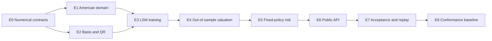

# Early Exercise Vertical Slice - Implementation Roadmap v0.1

Status: Accepted implementation baseline

Requirements: `requirements-v1.0.md`

Architecture: `architecture-v0.1.md`

## 1. Outcome

Complete the single-asset American vanilla MVP and a reusable Least-Squares
Monte Carlo policy boundary under the constant-volatility and Local Volatility
engines.

The accepted slice provides:

- American Call and Put contracts with explicit exercise schedules;
- a calendar-aware helper that materializes ordinary explicit schedules;
- independent policy-training and out-of-sample valuation path sets;
- deterministic polynomial features and column-pivoted QR regression;
- immutable exercise policies with complete rank and fit diagnostics;
- fixed-exercise-strategy Delta, Gamma, Vega, and Local Volatility VegaKT;
- frozen-stopping-index AAD and common-random-number bump validation;
- typed Rust, versioned JSON, and typed Python request/result surfaces;
- deterministic replay, statistical acceptance, and supported-platform
  benchmark evidence.

The existing event ordering, affine-dividend reconstruction, random-domain
registry, deterministic reductions, smoothing primitives, and risk reporting
are reused. LSM does not introduce a second simulation or diagnostics model.

## 2. Scope Boundary

### Included

- fixed-strike American vanilla Calls and Puts;
- explicit, strictly increasing exercise dates containing expiry;
- a Weekend-plus-Custom-holidays business-day schedule helper;
- post-dividend exercise on exercise-date/ex-date collisions;
- strictly-greater exercise decisions, with equality continuing;
- total-degree polynomial bases with deterministic graded ordering;
- training-ITM-only feature scaling with population standard deviation;
- pure-Rust column-pivoted QR with explicit absolute and relative rank
  tolerances;
- per-date `ContinueAll` policies when no training path is in the money;
- independent `LsmTrain` and `Valuation` random domains and sample counts;
- Pseudo-MC and randomized Sobol QMC valuation using a frozen policy;
- fixed-policy pathwise Delta/Vega, bumped-AAD Gamma, and Local Vega/VegaKT;
- fixed-policy CRN validation with frozen stopping indices;
- policy fingerprints, regression diagnostics, warnings, and replay metadata.

### Excluded

- Bermudan products other than the American contract represented by an
  explicit schedule;
- stochastic interest rates, stochastic dividends, FX, quanto, and
  cross-currency exercise;
- differentiation through QR, feature scaling, policy fitting, or the exercise
  boundary;
- policy refitting during Greek bump validation;
- Ridge, SVD, neural-network, or implicit fallback regressions;
- dual estimators, policy iteration, control variates specific to American
  options, and exercise-boundary smoothing;
- callable structured products and Autocallables, which reuse this policy
  boundary in a later slice.

## 3. Invariants

1. Training and valuation paths are disjoint and use fixed random domains.
2. Only training paths with immediate value above the declared ITM tolerance
   enter a date's regression.
3. Valuation observations never affect fitted feature means, scales,
   coefficients, ranks, pivots, or warnings.
4. Expiry intrinsic value is applied directly; expiry is never regressed.
5. At earlier dates, exercise occurs only when immediate value is strictly
   greater than continuation value. Equality continues.
6. An exercise colliding with a dividend event observes post-dividend Spot.
7. Polynomial columns follow one versioned graded order in Rust, JSON, Python,
   fingerprints, coefficients, and diagnostics.
8. Pivot ties use original column order. Below-threshold columns and all later
   pivots are excluded and represented by zero coefficients.
9. A zero-ITM date produces its own `ContinueAll` decision; no later policy is
   reused.
10. Primary AAD and CRN bumps use one fitted policy and one realized stopping
    index per valuation path. Neither operation refits or moves the boundary.
11. Policy identity includes dates, basis, scaling, rank tolerances, pivots,
    coefficients, comparison policy, and training configuration.
12. Existing European, Local Volatility/VegaKT, and Path Dependence replay
    contracts remain unchanged.

## 4. Delivery Graph

E1 and E2 may proceed independently after E0. Public serialization is frozen
only after the policy and risk identities are exercised end to end.

## 5. Gate Plan

### E0 - Numerical Contracts and Fixtures

Deliver:

- a versioned contract for strict exercise comparison, ITM classification,
  feature standardization, graded basis ordering, pivot selection, rank tests,
  residuals, and policy fingerprints;
- independently generated basis, scaling, QR, rank-deficiency, and exercise
  decision fixtures;
- declared `f64` operation order, tolerances, and error taxonomy.

Gate:

- fixtures are checked without calling production formulas;
- full-rank, rank-deficient, zero-scale, zero-ITM, tie, and expiry cases pass;
- no numerical choice required by E1-E5 remains implicit.

### E1 - American Contract and Event Schedule

Deliver:

- validated American vanilla product terms and explicit exercise dates;
- the calendar-aware materialization helper;
- normalized exercise events after dividend jumps and post-jump observations;
- source graph, plan, and product fingerprint participation.

Gate:

- missing expiry, duplicates, unordered dates, invalid payments, and schedule
  adjustment collisions are typed errors;
- zero-volatility Calls and Puts match deterministic backward exercise;
- dividend collisions use post-jump Spot without extra random coordinates.

### E2 - Polynomial Basis and Pivoted QR

Deliver:

- `PolynomialBasisSpec` and deterministic exponent enumeration;
- checked feature matrix sizing and training-ITM-only standardization;
- a pure-Rust column-pivoted QR solver with deterministic pivot ties;
- original-order coefficients and complete rank/residual diagnostics.

Gate:

- degree-zero, one-dimensional, and interaction bases match fixtures;
- full-rank solutions match independent high-precision references;
- zero-scale and dependent columns follow deterministic exclusion rules;
- malformed dimensions, non-finite inputs, and unsafe allocations fail before
  mutation or large allocation.

### E3 - Policy Training

Deliver:

- backward policy fitting on the independent `LsmTrain` path set;
- ITM filtering, discounted continuation targets, and per-date regressions;
- explicit `ContinueAll` decisions and structured warnings;
- immutable policy models and canonical policy fingerprints.

Gate:

- training never reads valuation paths or the `Valuation` random domain;
- fitted models reproduce fixture decisions and diagnostics exactly;
- antithetic units and RQMC scrambles retain their existing count semantics;
- policy fingerprints replay across worker counts and scheduling orders.

### E4 - Out-of-Sample Valuation

Deliver:

- frozen-policy valuation on independent paths;
- path-associated stopping indices and selected cash-flow records;
- Pseudo-MC and RQMC uncertainty using existing independent-unit rules;
- exercise probability, stopping-date, and cash-flow diagnostics.

Gate:

- American Put values respect intrinsic and European lower bounds within
  sampling uncertainty;
- no-dividend American Calls agree with European Calls within reported
  uncertainty;
- in-sample and out-of-sample estimates remain separately labelled;
- worker count does not change same-platform result bits.

### E5 - Fixed-Policy Risk

Deliver:

- pathwise/AAD Delta and Vega with bumped-AAD Gamma;
- Local Volatility reverse and VegaKT projection through selected cash flows;
- CRN bump validation using the same policy and stopping indices;
- explicit fixed-exercise-strategy and frozen-stopping-index risk labels.

Gate:

- AAD agrees with fixed-policy finite differences path by path;
- aggregate AAD and CRN validation agree within declared uncertainty;
- base, AAD, Spot bumps, and volatility bumps retain path and stopping-index
  identity;
- no result is labelled as a fully reoptimized exercise-boundary derivative.

### E6 - Rust, Wire, and Python API

Deliver:

- Rust builders for American contracts, LSM configuration, and schedules;
- versioned request/result DTOs, schemas, golden fixtures, and migration rules;
- typed Python builders, immutable policy/diagnostic views, stubs, and examples;
- complete replay metadata for training and valuation phases.

Gate:

- round trips preserve all dates, tolerances, counts, basis terms, and policy
  identity;
- schemas reject unknown fields, invalid integer tokens, and malformed tagged
  variants;
- clean-wheel tests execute Black-Scholes and Local Volatility American cases;
- Rust and Python produce identical normalized requests and fingerprints.

### E7 - Acceptance, Replay, and Performance

Deliver:

- deterministic and statistical American Call/Put acceptance grids;
- independent reference comparisons and in/out-of-sample bias evidence;
- supported-platform replay fixtures for Price and fixed-policy Greeks;
- training, valuation, AAD, CRN validation, and peak-memory benchmarks.

Gate:

- Apple Silicon macOS and Windows x86-64 CI pass Rust and wheel suites;
- same-platform replay is bitwise stable for the pinned toolchain;
- statistical assertions derive limits from independent sampling uncertainty;
- benchmark evidence waives no correctness or independence failure.

### E8 - Conformance Baseline

Deliver:

- Early Exercise diagnostics and conformance reports;
- frozen numerical policy, schemas, fixtures, examples, and replay artifacts;
- README and release-readiness status updates.

Gate:

- every included requirement has direct, current retained evidence;
- no unresolved correctness item is described only as a known limitation;
- previous conformance baselines remain green;
- the Autocallable stage can reuse the policy-training, stopping-index, and
  fixed-policy risk contracts without redesign.

## 6. Suggested Pull-Request Sequence

1. E0 numerical contracts and independent fixtures;
2. E1 American product and event schedule;
3. E2 polynomial basis and pivoted QR;
4. E3 policy training;
5. E4 independent out-of-sample valuation;
6. E5 frozen-policy AAD and CRN validation;
7. E6 Rust, wire, and Python API;
8. E7 replay, statistical acceptance, and benchmarks;
9. E8 conformance report and release baseline.

Each review unit retains a green stacked base. A policy format is not exposed
publicly until the numerical contract and end-to-end execution prove that its
identity is complete.

## 7. Test Matrix

| Area | Deterministic | Property/metamorphic | Statistical/reference | Cross-language |
| --- | --- | --- | --- | --- |
| Exercise schedule | ordering and expiry | calendar materialization | deterministic exercise | Rust/Python parity |
| Basis | exponent fixtures | graded-order completeness | high-precision evaluation | schema/stub parity |
| QR | pivot and rank fixtures | column-scale/rank behavior | independent solver residuals | diagnostics parity |
| Training | zero-ITM and ties | domain/sample isolation | in/out-of-sample bias | policy metadata parity |
| Valuation | stopping indices | worker-count replay | European/no-dividend bounds | result parity |
| Risk | pathwise finite differences | frozen-policy identity | AAD versus CRN bumps | labels and units |
| Local Volatility | constant variance limit | time-step refinement | Vega/VegaKT reconciliation | builder parity |

## 8. Implementation Rules

- Extend the existing product, event, plan, executor, risk, and diagnostics
  boundaries; do not create an American-only simulation engine.
- Keep training and valuation APIs explicit. A caller must be able to audit
  both sample counts and random domains.
- Store fitted scaling and coefficients in immutable date-local models.
- Keep QR and feature construction outside path-execution hot loops.
- Use checked arithmetic before allocating path-by-feature matrices.
- Preserve scalar operation, pivot, basis, event, reverse, and reduction order.
- Emit typed errors for invalid configuration and structured warnings for
  valid but rank-deficient or zero-ITM training states.
- Add tests at the owning numerical crate and at the facade boundary.

## 9. Principal Risks and Controls

| Risk | Control |
| --- | --- |
| Look-ahead bias | independent training and valuation domains |
| Hidden regression fallback | one explicit pivoted-QR policy |
| Platform-dependent rank | versioned arithmetic, pivots, and tolerances |
| Boundary instability | strict exercise comparison with equality continuing |
| Greeks move the policy | immutable policy and frozen stopping indices |
| Mislabelled sensitivity | fixed-strategy and frozen-index diagnostics |
| Dividend collision ambiguity | exercise after the post-jump observation |
| Memory blow-up | checked matrix limits and retained peak-memory evidence |
| Prior replay drift | unchanged existing request paths and fixtures |

## 10. Completion Definition

This slice is complete only when Gates E0-E8 pass, every included requirement
is mapped to retained evidence, and supported-platform CI proves training,
out-of-sample valuation, fixed-policy risk, and packaged Rust/Python workflows.
An in-sample LSM price, an isolated QR solver, or a fitted policy without
frozen-strategy risk evidence does not establish completion.
