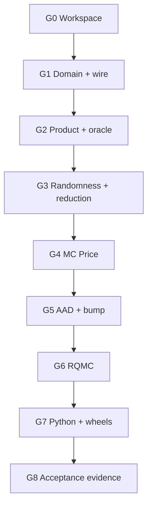

# European Black–Scholes Vertical Slice — Implementation Roadmap v0.1

Status: Ready for implementation
Date: 2026-09-03
Requirements baseline: `requirements-v1.0.md` (Frozen)
Architecture baseline: `architecture-v0.1.md`

## 1. Outcome

The first implementation increment shall deliver one complete, production-shaped path through the library:

> A Python or Rust caller constructs a single-currency European equity call or put, supplies Spot, discount and continuous-dividend curves, selects Black–Scholes and Pseudo-Monte Carlo or randomized Sobol QMC, and receives Price, uncertainty, Delta, Gamma, Vega, diagnostics, and replay metadata.

The slice is accepted only when it is independently checkable against:

1. analytical Black–Scholes Price and Greeks;
2. common-random-number bump-and-revalue;
3. deterministic replay from the complete normalized request.

This is a vertical slice, not a disposable prototype. Public types, compilation boundaries, RNG addressing, deterministic reduction, compiled payoff execution, AAD interfaces, errors, and Python ownership rules must be compatible with the later Local Volatility and VegaKT slice.

## 2. Scope boundary

### Included

- European call and put with one expiry and fixed strike;
- Black–Scholes Spot dynamics with deterministic rate, continuous dividend yield, and volatility;
- date-based public inputs and ACT/365F or ACT/360 internal year fractions;
- log-linear discount-factor curves with flat-forward extrapolation;
- exact Black–Scholes transition to expiry;
- Pseudo-MC using Philox4x32-10, optional antithetic variates, AS241 Normal inverse;
- randomized Sobol QMC using the agreed Joe–Kuo, LMS, Digital-shift, and scramble policies;
- deterministic fixed-block reduction on a dedicated Rayon pool;
- exact European payoff in the compiled payoff tape;
- Price, standard error, confidence interval, Delta, Gamma, and scalar Vega;
- dedicated Simulation reverse for Delta and Vega;
- Gamma from a central bump of AAD Delta;
- common-random-number bump validation;
- Rust facade and Python bindings;
- versioned JSON request/result round-trip and deterministic fingerprints;
- Apple Silicon macOS and Windows x86-64 wheel build/test jobs.

### Deferred from this slice

- Local Volatility, SSVI/eSSVI, Dupire, Local Vega, and VegaKT;
- discrete cash or proportional dividends in simulation;
- multiple observation dates, early exercise, barriers, smoothing, and rebates;
- multiple underlyings and correlation;
- LSM, Asian, Lookback, Basket, Worst-of, and Autocallable products;
- portfolio batching and distributed execution;
- performance promises beyond recording a trustworthy baseline.

The analytical formula is a reference oracle for this slice. It need not yet become a separately supported public pricing engine.

## 3. Delivery strategy

Every Gate must leave the workspace buildable, tested, and reviewable. A later Gate may extend an API but shall not bypass a failed earlier acceptance condition.

## 4. Gate plan

### G0 — Workspace, policy, and continuous integration

Deliverables:

- initialize the Cargo workspace using the crate dependency direction in the architecture;
- add the stable facade crate and private implementation crates;
- pin the Rust toolchain and dependency lockfile;
- establish formatting, linting, unit-test, documentation-test, and license checks;
- establish feature boundaries for `aad`, `qmc`, and `python` without changing pricing semantics;
- create CI jobs for macOS Apple Silicon and Windows MSVC;
- record compiler version, target, feature set, build profile, and dependency-lock fingerprint in test artifacts;
- add ADR templates and a requirements-change template.

Gate:

- an empty facade imports from Rust and Python smoke tests;
- all supported targets compile with warnings denied for project code;
- dependency-direction tests or metadata checks reject an upward crate dependency;
- release builds do not enable CPU-dependent floating-point fast-math behavior implicitly.

### G1 — Core domain, market input, wire DTO, and errors

Deliverables:

- implement checked IDs, finite numeric wrappers where required, date-only values, calendars, ACT/365F, and ACT/360;
- implement immutable discount-factor curves with log-linear interpolation and flat-forward extrapolation;
- construct Spot and continuous-dividend inputs sufficient to compute the forward;
- define `EuropeanVanillaSpec`, `BlackScholesSpec`, `PseudoMcConfig`, `RqmcConfig`, and `RiskRequest`;
- define `PricingRequest`, `PricingResult`, diagnostics, warnings, and structured error types;
- implement strict current-version wire DTOs, deterministic JSON, JSON Pointer validation issues, and BLAKE3 typed fingerprints;
- generate and freeze the current Draft 2020-12 schemas from the wire DTOs;
- install an empty forward migration registry for Schema v1 so the extension point is exercised without fictitious migrations.

Gate:

- invalid dates, curves, volatility, strike, expiry, enum tags, non-finite values, unknown fields, and resource-limit breaches fail before compilation;
- equivalent non-canonical JSON inputs normalize to identical typed fingerprints;
- compact and pretty JSON round-trip through Rust and Python-facing adapters;
- Golden request/result fixtures are byte-stable on both supported platforms.

### G2 — European product compilation and analytical oracle

Deliverables:

- build the European call/put through the public product builder;
- compile it to the Source Event/Payoff graph and then to the dense payoff tape;
- use deterministic NodeId allocation, Kahn ordering, constant folding, liveness analysis, and Graph limits;
- implement exact terminal payoff `max(±(S_T-K), 0)` with the agreed equality convention;
- implement an internal analytical Black–Scholes oracle for Price, Delta, Gamma, and Vega;
- cover zero-time, deep ITM/OTM, near-zero volatility, large/small discount factors, and put-call parity with explicitly defined limiting behavior.

Gate:

- the built-in European builder and an equivalent manually composed Source graph compile to semantically equivalent outputs;
- graph fingerprints and logical-tape fingerprints are deterministic;
- analytical values satisfy put-call parity and finite-difference identities over a broad regular-domain grid;
- singular or undefined limiting inputs return specified results or typed errors, never accidental NaN/Infinity.

### G3 — Addressable randomness and deterministic reduction

Deliverables:

- implement Philox4x32-10 with the frozen key, counter, Domain ID, lane, and open-interval mapping;
- implement AS241 with original double coefficients, fixed Horner order, and FMA disabled;
- implement antithetic sampling as exact sign reversal without consuming coordinates;
- create the dedicated Rayon thread pool and fixed logical path blocks;
- implement fixed-order scalar `f64` accumulators for count, sum, sum of squares, covariance diagnostics, and warning counters;
- separate logical sampling-unit count from evaluated-path count.

Gate:

- known-answer Philox and AS241 vectors pass;
- every `(domain, path, dimension)` maps to exactly one reproducible variate;
- reordering Rayon task completion cannot change reduced bits for a fixed calculation configuration;
- antithetic mode evaluates `2N` paths from `N` independent sampling units and consumes no additional RNG dimensions;
- repeated runs are bitwise identical on the same supported platform and recorded configuration.

### G4 — Pseudo-MC Price path

Deliverables:

- compile an immutable one-expiry `SimulationPlan`;
- simulate the exact lognormal terminal state using the market forward and total variance;
- execute terminal payoff blocks through the compiled dense opcode tape;
- discount path cashflows and perform fixed-block reduction;
- return Price, estimator variance, standard error, confidence interval, independent-unit count, evaluated-path count, and full diagnostics;
- release the Python GIL at the eventual facade boundary, even though Python packaging is completed later.

Gate:

- across the acceptance grid, analytical Price lies within the documented sampling-error criterion of the MC estimate;
- the reported standard error is based on independent sampling units and handles antithetic pairs as one unit;
- call/put monotonicity, bounds, parity reconciliation, and discounting invariants pass;
- Price-only execution allocates no AAD buffers;
- seeded Golden replays are bitwise stable on each supported platform.

### G5 — AAD Greeks, Gamma, and bump validation

Deliverables:

- activate Spot and volatility as risk factors in the dedicated Simulation reverse;
- implement the European subset of the compiled payoff reverse tape;
- use State-major SoA buffers, fixed AAD tiles, 64-byte alignment, deterministic padding, and event-boundary checkpoint contracts;
- compute pathwise AAD Delta and Vega for the exact payoff almost everywhere;
- compute Gamma by centrally bumping AAD Delta with fixed random coordinates;
- implement Price bump-and-revalue and fixed-coordinate comparisons for Delta, Vega, and Gamma;
- return Raw and Market-scaled units, estimator uncertainty, bump sizes, and method metadata.

Gate:

- AAD Delta and Vega agree with both the analytical oracle and matching common-random-number bumps under a combined sampling/finite-difference tolerance;
- Gamma agrees with analytical Gamma and a matching central validation bump under a documented bump ladder;
- Price from the risk-enabled run is bitwise identical to Price-only execution when the same primal path is selected by configuration;
- adjoint fan-in and reduction order are deterministic;
- inactive and padded lanes remain exact zero and cannot affect results.

### G6 — Randomized Sobol QMC

Deliverables:

- embed and checksum Joe–Kuo 6.21201 direction numbers up to dimension 21,201;
- implement MSB-first unit lower-triangular LMS plus Digital shift;
- generate all `scramble × dimension` matrices and shifts at Plan compile time from the independent scramble seed;
- require a power-of-two point count per scramble and expose a rounding helper;
- use point index zero and the same open-interval/AS241/antithetic mappings as Pseudo-MC;
- implement the non-uniform Brownian-bridge planner even though the European one-factor terminal slice uses one effective bridge coordinate;
- estimate Price and Greeks independently for each of 16 scrambles and report between-scramble uncertainty.

Gate:

- Sobol, LMS, Digital-shift, and dimension-order Golden vectors pass;
- results are invariant to worker completion order for a fixed Plan;
- uncertainty is computed from 16 independent scramble estimates, not from correlated points within one scramble;
- the analytical oracle satisfies the documented RQMC error criterion across the acceptance grid;
- changing the scramble seed changes the randomized estimate while preserving replay under the new seed.

### G7 — Stable facade, Python API, and private wheels

Deliverables:

- expose Rust builders plus `compile`, `evaluate`, and replay-oriented serialization through the facade;
- expose immutable Python product, market, model, engine, risk-request, result, diagnostic, warning, and validation-issue objects;
- accept `datetime.date` and strict ISO date strings and NumPy-compatible dense numeric inputs;
- release the GIL during compile/evaluate work and avoid Python callbacks in worker threads;
- map Rust validation and pricing errors atomically to structured Python exceptions;
- ship type hints, concise docstrings, examples, and private wheels for both supported targets;
- add one notebook-style Python example without making notebooks part of the test oracle.

Gate:

- equivalent Rust and Python requests produce identical normalized request and Plan fingerprints;
- Rust and Python results match bitwise for the same platform, binary, and full configuration;
- no borrowed NumPy/Python memory outlives the GIL-protected conversion step;
- wheel import, evaluation, exception mapping, JSON round-trip, and replay smoke tests pass on macOS and Windows.

### G8 — Acceptance evidence and baseline

Deliverables:

- create a fixed analytical acceptance grid spanning call/put, moneyness, maturity, rate, dividend yield, and volatility;
- run deterministic unit, property, metamorphic, statistical, and cross-language tests;
- record Pseudo-MC and RQMC accuracy evidence, including standard-error calibration across multiple seeds;
- benchmark compile, Price-only, AAD-risk, bump-risk, and Python-call paths;
- record wall time, paths per second, peak memory, allocation counts where available, compiler/build metadata, and CPU identity;
- document every warning and diagnostic emitted by the slice;
- freeze replay fixtures and publish the first implementation conformance report.

Gate:

- all acceptance checks in Section 6 pass on both supported targets;
- no open correctness issue is waived by a performance result;
- benchmark results are treated as the baseline for later optimization, not as a contractual latency SLA;
- the Local Volatility/VegaKT slice can begin without changing the public European product, result, RNG-addressing, reduction, or Python ownership contracts.

## 5. Suggested pull-request sequence

Keep review units narrow even when several are developed on one branch:

1. workspace skeleton, CI, policies, and crate boundaries;
2. core scalar/date/error types;
3. curves, forward construction, and Black–Scholes inputs;
4. current wire DTO, deterministic JSON, Schema generation, and fingerprints;
5. European graph builder, compiler subset, and analytical oracle;
6. Philox and AS241 known-answer implementation;
7. fixed path blocks, Rayon pool, and deterministic reduction;
8. Pseudo-MC terminal simulation and Price result;
9. Simulation reverse, payoff reverse, Delta, and Vega;
10. Gamma, CRN bump engine, and bump-ladder diagnostics;
11. Sobol direction data, LMS/Digital shift, Brownian-bridge plan, and RQMC estimates;
12. Rust facade hardening and end-to-end replay;
13. PyO3 objects, exceptions, NumPy/date conversion, and GIL release;
14. macOS/Windows private wheel pipeline;
15. conformance grid, statistical evidence, benchmarks, and documentation.

No PR may introduce a second implementation of a frozen convention merely to satisfy a local test. Shared conventions belong in their designated lower-level crate and must be exercised through the facade.

## 6. Slice acceptance checks

### 6.1 Deterministic correctness

- analytical Price and Greeks pass high-precision reference fixtures over the regular domain;
- put-call parity holds using the same discount and forward conventions;
- invalid inputs produce the expected stable error code and RFC 6901 pointer;
- a normalized request round-trip preserves its typed fingerprint;
- replaying the same seed, Plan, numerical settings, thread configuration, binary, and platform produces bitwise-identical output fields covered by the reproducibility contract.

### 6.2 Statistical correctness

- Pseudo-MC Price error is judged against its estimated standard error, not a single arbitrary absolute tolerance;
- antithetic uncertainty uses independent pair means;
- RQMC uncertainty uses the sample dispersion of independent scramble estimates;
- multi-seed coverage tests check that reported intervals are empirically calibrated without requiring every individual run to contain the oracle;
- all acceptance reports distinguish sampling error, finite-difference truncation, and any deterministic numerical error.

### 6.3 Risk correctness

- analytical, AAD, and CRN-bump Delta/Vega reconcile on the same market convention;
- analytical Gamma, central bump of AAD Delta, and validation bump reconcile under an explicit bump ladder;
- Raw and Market-scaled values are both tested;
- Price and each Greek identify estimator, active risk factor, bump/smoothing policy where applicable, and uncertainty method;
- the exact vanilla payoff remains unsmoothed in this slice; smoothing infrastructure is introduced with discontinuous products.

### 6.4 API and packaging correctness

- public Rust and Python examples compile or execute in CI;
- Python exceptions expose immutable ordered issues and never partial domain objects;
- JSON request/result fixtures validate against the bundled current Schema;
- both private wheels install into clean supported Python environments;
- the public facade does not expose compiled tape bytes, native pointers, or mutable execution buffers.

## 7. Test matrix

| Layer | Required test classes |
| --- | --- |
| Core | unit, boundary, invalid-value, date/day-count, serialization Golden |
| Market | interpolation, extrapolation, forward identities, curve validation |
| Product/compiler | graph validation, deterministic ordering, tape equivalence, limits |
| RNG | known-answer, address uniqueness, lane mapping, antithetic identity |
| Reduction | task-order permutation, block boundary, padding, repeated-run bits |
| Analytical | parity, monotonicity, limiting cases, finite-difference checks |
| Pseudo-MC | oracle reconciliation, standard-error calibration, replay |
| AAD/risk | oracle, CRN bump, bump ladder, primal equality, inactive adjoints |
| RQMC | Sobol/scramble Golden, seed replay, between-scramble uncertainty |
| Python | Rust parity, ownership, GIL release, exceptions, wheel smoke |

## 8. Implementation rules

- Prefer a complete thin path over broad unexercised abstractions.
- Do not add Local Volatility branches to Black–Scholes kernels; introduce model extension points at Plan compilation.
- Do not use traits or heap allocation in the per-path hot loop when a compiled enum or specialized kernel suffices.
- Do not use external BLAS for this slice; no implemented operation requires it.
- Keep logical Reduction blocks independent of Rayon scheduling and AAD tile size.
- Make defaults versioned constants and include effective values in normalized Plan metadata.
- Treat warnings as structured outputs with stable codes, never log-only side effects.
- Keep the analytical oracle independent of MC and AAD implementation code except for shared market conventions.
- Add optimization only after the corresponding correctness and replay tests exist.

## 9. Principal risks and controls

| Risk | Control in this slice |
| --- | --- |
| Architecture over-generalization | Require every abstraction to be exercised by the European path |
| Hidden nondeterminism | Addressable RNG, fixed blocks, fixed reduction order, Golden replay |
| AAD primal drift | Bitwise comparison of Price-only and risk-enabled primal results |
| Incorrect uncertainty | Independent-unit accounting for antithetic and scramble estimators |
| Analytical-oracle coupling | Separate implementation and invariant/property checks |
| Python/Rust semantic drift | One Rust validation/evaluation implementation and cross-language fingerprints |
| Schema churn | Frozen wire DTO Golden files and reviewed version increments |
| Platform floating-point drift | Per-platform replay fixtures and fixed operation order; no cross-platform bitwise promise |
| Premature optimization | Baseline measurement after correctness Gates; profiling evidence required |

## 10. Completion definition

The European Black–Scholes vertical slice is complete when:

1. G0 through G8 are all accepted with retained CI evidence;
2. a clean Rust example and a clean Python example produce the documented structured result;
3. Pseudo-MC, RQMC, AAD, bump, and analytical results reconcile under the documented statistical and numerical criteria;
4. replay is bitwise stable on each supported platform for the complete frozen configurations;
5. private wheels are installable on Apple Silicon macOS and Windows x86-64;
6. no unresolved requirement ambiguity blocks the subsequent Local Volatility/VegaKT slice;
7. the conformance report records known limitations without silently weakening the frozen requirements.

The next implementation roadmap begins with SSVI/eSSVI input, Dupire Local variance, Log-Euler simulation, Local Vega AAD, and the paper-defined VegaKT decomposition while reusing the accepted infrastructure from this slice.
