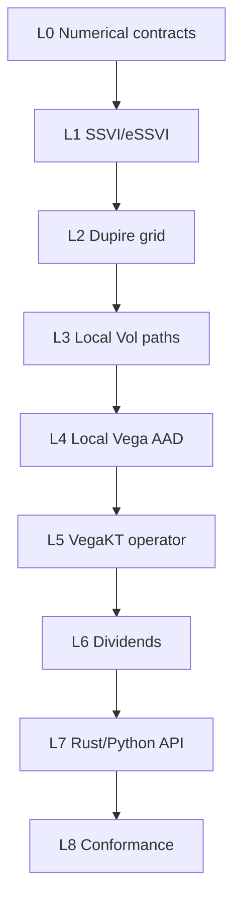

# Local Volatility and VegaKT Vertical Slice — Implementation Roadmap v0.1

Status: Accepted
Date: 2026-09-08
Requirements baseline: `requirements-v1.0.md` (Frozen)
Architecture baseline: `architecture-v0.1.md`
Predecessor: `european-bs-conformance-v0.1.md` (Accepted)

## 1. Outcome

This slice shall let a Rust or Python caller price one European equity option
under Dupire Local Volatility using calibrated Standard SSVI or eSSVI input and
receive Price, uncertainty, Delta, Gamma, Scalar Vega, Local Vega, and the
paper-defined VegaKT decomposition.

The implementation reuses the accepted European Black–Scholes contracts for
products, curves, RNG addressing, deterministic reduction, replay metadata, and
Python ownership. It adds model and risk segments; it does not fork those
foundations or turn SSVI reporting nodes into fictitious independent calibration
parameters.

The VegaKT reference algorithm is Joachim Adrien et al., *Vega KT for the Local
Volatility Model: An AD Approach*, SSRN 4107770. The affine discrete-dividend and
continuous-martingale coordinate design follows Guyon and Henry-Labordère, *The
Smile Calibration Problem Solved*, SSRN 1885032. LSV-specific sensitivities from
SSRN 4304114 remain a future extension.

## 2. Scope boundary

### Included

- calibrated Standard SSVI with global `rho` and Power-law or Heston-like
  `phi`, plus a non-decreasing C1 PCHIP ATM total-variance curve;
- calibrated eSSVI slices with arbitrage-preserving interpolation of `theta`,
  `psi`, and `rho*psi`;
- analytic total-variance derivatives and analytic call density;
- implied volatility in the continuous-martingale `f` coordinate;
- explicit Local-variance Floor and Cap, explicit rectangular nodes, and an
  optional density-quantile/piecewise-sinh node helper;
- Dupire Local-variance construction with structured clamp diagnostics;
- bilinear Local-variance interpolation and flat horizontal boundary behavior;
- Log-Euler simulation of continuous `f` on an event-plus-substep time grid;
- calculation-specific maximum `delta_t`;
- European Price, Delta, Gamma, Local Vega, Scalar Vega, and VegaKT;
- compact piecewise-linear hat projection for Local Vega;
- equation (11) first-order Local-Gamma recovery;
- analytic-density active domain and residual sensitivity reporting;
- cell-integrated transition kernels on non-uniform grids with semi-infinite
  outer cells;
- bilinear reporting-IV basis on explicit maturity/log-forward-moneyness nodes;
- per-bucket uncertainty and Price covariance, with opt-in full covariance;
- common-random-number validation of selected and aggregate reporting-basis
  perturbations;
- deterministic JSON, fingerprints, replay fixtures, Rust facade, and Python
  builders/results.

### Deferred

- SSVI/eSSVI calibration from raw option quotes;
- implied volatility quoted against the discontinuous Spot process;
- Local Stochastic Volatility and leverage calibration;
- Digital, Barrier, Asian, Lookback, American, Basket, Worst-of, and
  Autocallable products;
- multi-asset correlation;
- portfolio batching or distributed execution;
- an independently supported SSVI-parameter Greek report.

Discrete fixed-cash and proportional dividends belong to the architecture of
this slice. Their complete simulation support may be delivered after the
no-discrete-dividend Local Vol/VegaKT path, but before final acceptance.

## 3. Delivery graph

Each Gate must leave existing Black–Scholes fixtures unchanged. A new numerical
policy is compiled and fingerprinted before it is used by a path kernel.

| Gate | Status | Evidence |
| --- | --- | --- |
| L0 Numerical contracts | Accepted | `local-vol-vegakt-numerical-contracts-v0.1.md` and `fixtures/local-vol/reference-cases-v0.1.json` |
| L1-L8 | Accepted | `local-vol-vegakt-conformance-v0.1.md` |

## 4. Gate plan

### L0 — Numerical contracts and paper fixtures

Status: Accepted under policy `local_vol_vegakt_v1`.

Deliverables:

- freeze exact Standard SSVI/eSSVI formulas, small-`theta` branches, analytic
  derivatives, and admissibility inequalities;
- specify absolute/relative admissibility tolerances and terminal forward-
  variance slope validation;
- specify Dupire evaluation order and non-finite/non-positive/out-of-range clamp
  reasons;
- version non-uniform hat normalization and transition-cell integration rules;
- define Local Vega, Local Gamma, VegaKT bucket, residual, covariance, and unit
  conventions in Rust-shaped data contracts;
- transcribe focused numerical reference cases from SSRN 4107770 and 1885032,
  recording page/equation provenance without copying executable formulas from a
  second implementation;
- fix test-only high-precision/reference implementations independently of the
  production kernels;
- list every remaining quantitative helper default and decide whether it is a
  required input or a versioned helper value.

Gate:

- no model or risk implementation depends on an unnamed tolerance, implicit
  Floor/Cap, implicit maximum `delta_t`, or implicit density threshold;
- reference cases and conservation identities are reviewable before production
  code is accepted.

### L1 — Calibrated SSVI/eSSVI surface

Deliverables:

- introduce `ImpliedVarianceSurface` and `TotalVarianceDerivatives` in
  `pricing-market`;
- implement Standard SSVI using one global surface, non-decreasing C1 PCHIP
  `theta(T)`, one `rho`, and `PhiSpec::{PowerLaw,HestonLike}`;
- implement stable analytic `w`, `dw/dk`, `d2w/dk2`, and `dw/dT` evaluation;
- implement eSSVI slice validation and interpolation of `theta`, `psi`, and
  `rho*psi`, recovering `rho` only after interpolation;
- implement short-end linear scaling and long-end explicit terminal-forward-
  variance extrapolation;
- expose analytic call price and density in forward-normalized `f` coordinates;
- compile both surface types into an enum dispatched outside hot grid loops;
- add wire DTOs, schemas, deterministic fingerprints, and Golden JSON.

Gate:

- analytic derivatives reconcile with high-accuracy finite differences over
  regular and small-`theta` domains;
- admissible examples pass and each violated condition returns a stable typed
  error with the correct JSON pointer;
- Standard SSVI and eSSVI can be exchanged without changing Dupire consumers.

### L2 — Dupire and Local-variance grid

Deliverables:

- implement the Dupire transform from analytic surface derivatives;
- add `LocalVarianceGrid` with explicit time nodes, non-uniform
  `x=log(f/F_f(T))` nodes, row-major values, and mandatory Floor/Cap;
- clamp invalid values while recording location, original bits/value, applied
  value, and reason in deterministic order;
- implement bilinear primal interpolation and its exact transpose/reverse
  accumulation with identical cell selection;
- keep horizontal out-of-range values constant at the nearest boundary and
  report counts plus maximum excursion;
- implement the optional grid helper from left/right `f`-density quantiles,
  separate paddings, and an exact-ATM two-sided piecewise-sinh map;
- materialize helper output as ordinary explicit serializable nodes.

Gate:

- constant/known surfaces reproduce analytic Local variance cases;
- primal/reverse interpolation passes dot-product tests;
- clamp and boundary diagnostics have stable codes and deterministic ordering;
- helper grids preserve node ordering, exact ATM, requested tail envelope, and
  cross-maturity rectangular coverage.

### L3 — Local Volatility path simulation

Deliverables:

- compile event dates plus uniform substeps satisfying explicit maximum
  `delta_t`;
- implement Log-Euler evolution of continuous `f` and reconstruct contract Spot
  only at required observations;
- cache or replay interpolation cells/weights under the accepted checkpoint and
  SoA tiling policies;
- keep Philox/RQMC coordinate addressing independent of worker scheduling;
- retain antithetic and Brownian-bridge conventions, using the compiled
  non-uniform time grid;
- produce Price and uncertainty through the existing fixed-block reduction;
- add time-step refinement diagnostics and a comparison against Black–Scholes
  when Local variance is constant.

Gate:

- constant Local Vol converges to the accepted Black–Scholes result;
- decreasing maximum `delta_t` shows the documented weak-convergence behavior;
- same-platform replay is bitwise identical across repeated runs and worker
  counts for a frozen complete Plan.

### L4 — Simulation reverse and Local Vega

Deliverables:

- add matched Log-Euler reverse rules for state and Local-variance interpolation;
- project pathwise Local-variance adjoints with the compact linear hat kernel of
  one local grid interval;
- share the Local-variance grid by default and accept a distinct explicit
  Local-Vega grid when requested;
- preserve partition of unity on non-uniform interior and boundary cells;
- aggregate Local Vega value, variance, and Price covariance using deterministic
  block statistics;
- retain only liveness-required interpolation/event cache data at checkpoints;
- validate selected Local-variance cells with common-random-number bumps.

Gate:

- path primal values are unchanged by enabling reverse mode;
- reverse interpolation and path adjoints pass directional-derivative tests;
- deposited Local Vega conserves the pathwise sensitivity within the declared
  active domain and boundary convention.

### L5 — Equation (11) and VegaKT decomposition

Deliverables:

- compute analytic call density from SSVI/eSSVI at every operator maturity;
- construct the maximum-density-relative active domain as the maximal connected
  qualifying interval containing the forward;
- return a typed error when the forward does not qualify;
- recover next-time Local Gamma using the paper's equation (11) first-order
  approximation and identify its time-step order in metadata;
- reconstruct Local Gamma piecewise-linearly on interior cells;
- integrate transition probability over each cell, with constant nearest-edge
  values on semi-infinite outer cells so total mass is retained;
- build `ReportingIvBasis` from SSVI/eSSVI-sampled node IVs and bilinear
  interpolation in maturity/log-forward-moneyness;
- project the continuum hedge density through the reporting-basis Jacobian;
- aggregate out-of-range strike sensitivity into edge buckets with a warning;
- report bucket estimates, coordinates, units, Price covariance, requested
  covariance layout, signed residual sensitivity, excluded domain/mass, and
  operator-policy metadata;
- define Scalar Vega as the deterministic in-domain canonical `f`-IV bucket sum.

Gate:

- hat, transition-mass, and reporting-basis partition-of-unity tests pass;
- bucket sum plus residual reconciles with the pre-projection sensitivity;
- equation (11) error exhibits first-order refinement behavior;
- selected-node and aggregate decomposition-basis CRN bumps reconcile within
  declared statistical and finite-difference bounds;
- one independent full repricing per reporting node is not used by production
  VegaKT.

### L6 — Affine discrete dividends

Deliverables:

- compile fixed cash and proportional dividends into
  `D_i(S)=alpha_i*S0+beta_i*S` with strict `D>=0` and `0<=beta<1` validation;
- update deterministic `A,B` at each event while keeping simulated `f`
  continuous and reconstructing `S=A*S0+B*f`;
- hold fixed-cash amount `D` under Spot bumps and recompile `alpha`;
- enforce Dividend-before-Expiry ordering on coincident dates;
- validate the SSRN 1885032 call-price matching condition to explicit tolerance;
- allow continuous maturity differentiation only on the canonical `f` surface;
- fail the entire calculation if reconstructed post-dividend Spot is non-positive;
- add event checkpoints and minimal dividend reverse cache.

Gate:

- affine identities, event ordering, matching condition, Spot-bump convention,
  and non-positive-Spot errors pass deterministic tests;
- Local Vol/VegaKT remains quoted only in canonical `f`-IV coordinates.

### L7 — Public Rust, JSON, and Python surface

Deliverables:

- expose immutable calibrated SSVI/eSSVI builders, explicit/local-grid helpers,
  Local Vol model configuration, and VegaKT requests through the Rust facade;
- expose equivalent typed PyO3 objects using `datetime.date` and ISO dates,
  NumPy-compatible dense arrays, immutable diagnostics, and GIL-released compile
  and evaluate calls;
- serialize dense grids as explicit shape plus flat row-major data;
- return canonical `f`-IV VegaKT coordinates and optional mapped Spot-contract
  strikes as non-risk metadata;
- add schemas, migration tests, stubs, examples, ownership tests, and
  Rust/Python fingerprint parity;
- keep compiled tapes, pointers, and mutable workspaces private.

Gate:

- Rust and Python construct the same normalized Plan and return the same typed
  result on each supported platform;
- old European Black–Scholes JSON and wheel examples remain compatible.

### L8 — Acceptance, replay, and performance baseline

Deliverables:

- freeze analytical SSVI/eSSVI derivative/density and Dupire fixtures;
- freeze Local Vol Price/risk/VegaKT replay fixtures per supported platform;
- run deterministic, property, metamorphic, refinement, statistical, and
  cross-language suites;
- benchmark Price-only, AAD Local Vega, VegaKT decomposition, selected/aggregate
  CRN bumps, and Python calls;
- record wall time, paths per second, peak memory/allocation count where
  available, compiler/build/CPU metadata, grid sizes, checkpoints, and covariance
  layout;
- publish all warning/diagnostic codes and the Local Vol/VegaKT conformance
  report.

Gate:

- every criterion in requirements Section 13.1 passes on Apple Silicon macOS and
  Windows x86-64;
- no correctness failure is waived by a performance result;
- Black–Scholes conformance and replay fixtures remain unchanged;
- the next discontinuous-product slice can reuse the compiled market, path,
  smoothing, risk, and Python contracts without redesign.

## 5. Suggested pull-request sequence

1. numerical policies, reference fixtures, and market error taxonomy;
2. Standard SSVI `theta` PCHIP and both `phi` families;
3. eSSVI interpolation/extrapolation and surface enum;
4. analytic derivatives, call density, wire DTOs, and Python builders;
5. Dupire builder, clamp diagnostics, and Local-variance grid;
6. non-uniform grid helper plus primal/reverse bilinear interpolation;
7. event/substep time grid and Log-Euler `f` simulation;
8. Local Vol Price replay and Black–Scholes limiting tests;
9. Log-Euler reverse and Local Vega hat projection;
10. analytic-density active domain and equation (11) Local Gamma;
11. cell-integrated transition operator and semi-infinite tails;
12. reporting-IV basis, VegaKT buckets/residuals, and Scalar Vega;
13. CRN basis-bump validation and covariance layouts;
14. affine discrete dividends and matching-condition tests;
15. Rust/Python facade, schemas, stubs, examples, and wheels;
16. refinement/statistical suites, replay fixtures, benchmarks, diagnostics, and
    conformance report.

Review units may be combined only when the lower Gate remains independently
testable. No PR may introduce a second RNG, reduction, forward, date, or payoff
implementation for convenience.

## 6. Numerical acceptance rules

- Analytical surface and density fixtures use deterministic relative/absolute
  error bounds stated per field and domain.
- Monte Carlo comparisons use paired estimators and their covariance wherever
  common random numbers are available.
- Finite-difference validation records bump magnitude, central/forward scheme,
  perturbation basis, surface rebuild policy, and truncation study.
- Equation (11), Log-Euler, and grid discretization errors are assessed through
  refinement; sampling error is reported separately.
- Conservation identities are tested before price/risk tolerances so compensating
  implementation errors cannot pass aggregate comparisons.
- Same-platform fixture checks compare exact serialized bytes and bit fields.
  Cross-platform results are compared numerically unless their bits happen to
  agree; equality is never promoted to a cross-platform guarantee.

## 7. Implementation rules

- SSVI/eSSVI supplies Dupire derivatives; bilinear reporting or Local-variance
  interpolation never substitutes for surface differentiation.
- The forward provider is the only source of `F_f(T)` and Spot-contract affine
  mappings.
- Surface, path, payoff, and risk reverse segments remain separate and testable.
- Dispatch model/surface enums outside the per-node/per-path inner loop.
- Do not allocate, lock, or perform dynamic trait dispatch inside a path step.
- Floor, Cap, maximum `delta_t`, active-density threshold, and explicit nodes are
  part of normalized reproducible input.
- Helper output is ordinary materialized input; helpers receive versioned
  defaults and never create a privileged runtime path.
- Warnings are structured successful-result data; invalid invariants and a
  non-positive reconstructed Spot are typed errors.
- LSV extension points live at the Local/Leverage Vega producer and calibration
  mapping boundary, not inside the Local Vol operator.

## 8. Principal risks and controls

| Risk | Control |
|---|---|
| Surface arbitrage or unstable derivatives | Explicit admissibility rules, analytic derivatives, and independent fixtures |
| Silent Dupire repair | Mandatory Floor/Cap and per-node structured clamp diagnostics |
| Grid truncation hiding sensitivity | Edge aggregation warning plus signed residual and excluded-mass reporting |
| Equation (11) division by tiny density | Connected active domain; exclude rather than denominator-clamp |
| Incorrect non-uniform integration | Cell-integrated kernels, semi-infinite tails, and unit-mass tests |
| Treating generated IV nodes as independent parameters | Paper-defined decomposition basis and explicit reporting semantics |
| Reverse/primal interpolation mismatch | Shared cell convention and transpose dot-product tests |
| Platform drift | Separate exact fixtures under the existing same-platform contract |
| LSV lock-in | Reusable VegaKT report/operator boundary and separate Local Vega producer |

## 9. Completion definition

The slice is complete when:

1. L0–L8 are accepted with retained CI evidence;
2. Standard SSVI and eSSVI both drive the same Dupire/Local Vol interfaces;
3. Local Vol Price and standard Greeks pass analytical, limiting, bump, and
   refinement checks;
4. Local Vega and VegaKT pass conservation, residual, uncertainty, and CRN bump
   reconciliation checks;
5. every clamp, boundary, exclusion, and edge-aggregation event is observable;
6. Rust and Python examples execute from calibrated surface input on both MVP
   platforms;
7. complete same-platform replay is bitwise stable;
8. the conformance report records limitations without weakening the frozen
   requirements.
