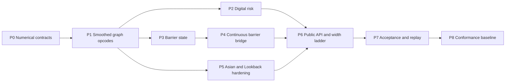

# Path Dependence Vertical Slice — Implementation Roadmap v0.1

Status: Accepted implementation baseline

Requirements: `requirements-v1.0.md`

Architecture: `architecture-v0.1.md`

## 1. Outcome

Complete the single-asset path-dependent MVP slice for Digital, Barrier,
arithmetic average-price Asian, and fixed-strike Lookback options under the
constant-volatility and Local Volatility engines.

The accepted slice provides:

- exact contractual Price-only valuation for all four product families;
- pathwise Price/Delta/Gamma/Vega for Asian and Lookback products;
- explicitly smoothed Price/Delta/Gamma/Vega for Digital and Barrier products;
- discrete and continuous barrier monitoring, including affine-dividend jumps;
- a shared compiled Payoff tape with matched primal and reverse rules;
- typed Rust, versioned JSON, and typed Python request/result surfaces;
- deterministic replay, statistical acceptance, and supported-platform
  benchmark evidence.

The implementation already contains exact Digital, discrete Barrier, Asian,
and Lookback product builders and Price execution. Asian and Lookback pathwise
risk is also present. Those capabilities are retained and hardened rather than
reimplemented. The remaining critical path is graph-level smoothing,
discontinuous-product risk, continuous barrier correction, and conformance
evidence.

## 2. Scope Boundary

### Included

- cash-or-nothing and asset-or-nothing Digital Calls and Puts;
- fixed-strike single Barrier Calls and Puts with Up/Down and KnockIn/KnockOut;
- discrete barrier monitoring and continuous bridge correction;
- optional fixed-cash Barrier rebate paid at expiry;
- arithmetic average-price Asian Calls and Puts with explicit weighted
  observations and known fixings;
- fixed-strike discrete-monitoring Lookback Calls and Puts with an optional
  historical extremum;
- compact C2 quintic smoothing for Indicator, Maximum, and Minimum nodes;
- explicit positive half-widths in each node's native units;
- a non-adaptive width ladder using common random coordinates;
- endpoint, diffusion-bridge, and affine-dividend-jump Barrier diagnostics;
- exact and smoothed valuation labels that cannot be confused;
- AAD and common-random-number bump validation for requested risks;
- same-platform replay fixtures for both supported targets.

### Excluded

- geometric-average and average-strike Asian options;
- floating-strike, partial, or continuously monitored Lookback options;
- double barriers, simultaneous multi-level windows, and first-passage-time
  rebates;
- adaptive smoothing-width selection or zero-width extrapolation;
- likelihood-ratio and Malliavin estimators;
- multiple underlyings, correlation risk, early exercise, and Autocallables;
- public serialization of native Compiled tape or runtime workspace bytes.

Explicit payment dates remain the contract boundary. Settlement-lag schedule
generation is not introduced by this slice.

## 3. Invariants

1. Exact Price-only mode preserves contractual inclusive touch semantics.
2. Smoothed mode reports a Price and Greeks from the same surrogate payoff.
3. Smoothing is never selected implicitly and every half-width is positive,
   finite, and expressed in the affected node's native units.
4. The quintic kernel is exactly zero and one outside `[-h, h]`, is one half at
   zero, and joins with continuous first and second derivatives.
5. Smoothed Maximum and Minimum are exact outside the band and preserve
   `min(a,b) + max(a,b) = a + b`.
6. Known Asian fixings and historical Lookback extrema are contractual
   constants with zero market adjoint.
7. An observation colliding with an affine-dividend ex-date uses post-dividend
   Spot. A jump that touches or crosses a Barrier is a deterministic hit.
8. Continuous bridge correction consumes no additional random coordinate and
   never treats a dividend jump as diffusion.
9. Source and logical-tape fingerprints include smoothing policy and remain
   deterministic under node storage order and thread scheduling.
10. Width-ladder valuations reuse the same logical random coordinates but are
    complete, separately labelled calculations.

## 4. Delivery Graph

P2, P3, and P5 may proceed in parallel after P1. P4 depends on explicit
Barrier state and diagnostics. P6 freezes the public boundary only after the
underlying numerical behavior is tested.

## 5. Gate Plan

### P0 — Numerical Contracts and Fixtures

Deliver:

- one versioned document fixing the quintic Indicator and integrated positive
  part formulas, boundary behavior, tie convention, and derivatives;
- independently generated fixtures at exterior, boundary, center, and interior
  points for value, first derivative, and second derivative;
- bridge-survival fixtures for up/down barriers, zero volatility, short time,
  near-touch endpoints, and affine-dividend crossings;
- explicit tolerances and error taxonomy.

Gate:

- fixtures are checked without calling production formulas;
- symmetry, translation equivariance, complementarity, partition, and finite
  derivative properties pass;
- no numerical-policy choice required by P1-P4 remains implicit.

### P1 — Smoothed Payoff Opcodes

Deliver:

- typed exact and compact-C2 Indicator modes;
- paired exact/smoothed Maximum and Minimum opcodes;
- matched primal and reverse implementations using one shared formula module;
- constant folding, graph limits, canonical encoding, and fingerprint support;
- deterministic reverse-liveness/cache accounting for the new opcodes.

Gate:

- finite-difference checks cover first derivatives throughout and around the
  transition band;
- exact opcodes preserve all existing payoff fingerprints and fixtures;
- smoothed opcode fingerprints change with kernel version and half-width;
- malformed, zero, negative, and non-finite widths are rejected before
  compilation.

### P2 — Digital Smoothed Risk

Deliver:

- standard Digital builders that compile exact Price-only or explicit smoothed
  Price/AAD plans;
- cash and asset payout adjoints for Calls and Puts;
- CRN bump validation for Delta, Gamma, and Vega;
- diagnostics identifying node, discontinuity, kernel, half-width, units, and
  exact/smoothed valuation label.

Gate:

- zero-volatility and analytical Black-Scholes references pass away from and at
  the transition band;
- AAD and CRN bumps agree within predeclared statistical and finite-difference
  tolerances;
- requesting discontinuous-product risk without smoothing remains a typed
  validation error.

### P3 — Barrier State and Discrete Monitoring

Deliver:

- an explicit monotone path hit/survival state rather than a payoff-only fold;
- exact inclusive endpoint and dividend-jump hit handling;
- smoothed endpoint and jump predicates, including the smoothed Maximum of
  pre/post-jump signed distances;
- KnockIn/KnockOut continuation and expiry-rebate weighting;
- distinct endpoint and dividend-jump diagnostics.

Gate:

- Up/Down and KnockIn/KnockOut parity identities pass with and without rebates;
- monitoring-date/ex-date collisions observe post-dividend Spot while retaining
  the pre/post jump crossing test;
- reverse checks cover both endpoint states and affine-dividend parameters;
- state updates are deterministic and never consume random coordinates.

### P4 — Continuous Barrier Bridge

Deliver:

- explicit discrete/continuous monitoring mode in the product contract;
- transformed continuous-martingale barrier endpoints for affine dividends;
- log-space Brownian-bridge conditional survival using trapezoidal interval
  Local variance;
- stable log-domain accumulation and matched reverse rules;
- bridge diagnostics separated from endpoint and jump contributions.

Gate:

- constant-volatility bridge results agree with analytical/reference values;
- Local Volatility results pass time-step and monitoring refinement checks;
- zero variance, touched endpoints, invalid transformed barriers, and numerical
  overflow use typed deterministic outcomes;
- bridge correction consumes no extra pseudo-MC or Sobol coordinate.

### P5 — Asian and Lookback Hardening

Deliver:

- complete contract validation for ordering, duplicate dates, weights, fixing
  classification, historical extrema, and payment ordering;
- metadata retaining known/unknown observation classification and fixed state;
- Local Volatility Price/Delta/Gamma/Vega coverage;
- exact graph behavior for observation/dividend collisions.

Gate:

- fully fixed products produce zero market Greeks and deterministic Price;
- partially fixed products keep historical state invariant under all bumps;
- analytical/geometric bounds, permutation metamorphisms, and monitoring
  refinement properties pass where applicable;
- Rust, JSON, and Python behavior is equivalent.

### P6 — Public API and Width Ladder

Deliver:

- Rust request types for smoothing policy, primary width, and optional ordered
  Width ladder;
- versioned wire DTOs, Draft 2020-12 schemas, golden fixtures, and migrations;
- typed Python builders, result accessors, stubs, exceptions, and examples;
- per-width Price/Greek records and adjacent-width differences;
- immutable diagnostics with exact/smoothed estimator labels.

Gate:

- round trips preserve every smoothing and monitoring field;
- strict schemas reject unknown properties and invalid tagged variants;
- the ladder does not adapt, rank, extrapolate, or silently choose a result;
- wheel smoke tests execute exact and smoothed examples from a clean install.

### P7 — Acceptance, Replay, and Performance

Deliver:

- deterministic and statistical acceptance grids for all four products;
- supported-platform replay fixtures for exact and smoothed calculations;
- Digital and Barrier AAD-versus-CRN risk evidence;
- benchmarks for exact Price, smoothed Price/AAD, width ladders, and continuous
  bridge correction;
- retained build, runtime, memory, random-plan, and payoff metadata.

Gate:

- Apple Silicon macOS and Windows x86-64 CI pass all Rust and wheel suites;
- same-platform replay is bitwise stable for pinned inputs and toolchain;
- cross-platform differences remain within documented numerical tolerances;
- performance results waive no correctness failure.

### P8 — Conformance Baseline

Deliver:

- `path-dependence-diagnostics-v0.1.md`;
- `path-dependence-conformance-v0.1.md` mapping every requirement to evidence;
- release-readiness and README status updates;
- frozen diagnostics, numerical policy, schemas, examples, and replay artifacts.

Gate:

- every included requirement has direct, current evidence;
- no unresolved correctness item is described only as a known limitation;
- European and Local Volatility/VegaKT conformance remains unchanged;
- the Multi-asset and Early Exercise stages can reuse the event, state,
  smoothing, simulation, and risk contracts without redesign.

## 6. Suggested Pull-Request Sequence

1. P0 smoothing and barrier numerical contracts with independent fixtures;
2. P1 compact-C2 graph opcodes and reverse rules;
3. P2 Digital smoothed Price/AAD and diagnostics;
4. P3 discrete Barrier state, affine-dividend crossings, and risk;
5. P4 continuous Barrier bridge correction and reverse rules;
6. P5 Asian/Lookback validation and Local Volatility conformance;
7. P6 Rust/wire/Python smoothing API and Width ladder;
8. P7 replay, statistical acceptance, and benchmark artifacts;
9. P8 conformance report and release baseline.

Each pull request must retain a green stacked base. A stack is integrated into
`main` from its oldest dependency to newest; changing a PR base must not bypass
the candidate commit's complete CI gate.

## 7. Test Matrix

| Area | Deterministic | Property/metamorphic | Statistical/reference | Cross-language |
| --- | --- | --- | --- | --- |
| Quintic kernel | Boundary and fixture vectors | Symmetry and derivative continuity | Finite differences | Rust/Python policy parity |
| Digital | Call/Put and cash/asset cases | Complement and payout scaling | Analytical BS and CRN Greeks | JSON/Python round trip |
| Discrete Barrier | Direction/style/rebate matrix | In/Out parity and date insertion | CRN Greeks | Builder/result parity |
| Continuous Barrier | Bridge fixture matrix | Refinement and no-extra-coordinate | Analytical/reference survival | Replay parity |
| Asian | Known/unknown/fixed matrix | Weight and fixing invariants | Analytical/geometric bounds | Builder/result parity |
| Lookback | Historical/future matrix | Extremum monotonicity | Monitoring refinement | Builder/result parity |
| Width ladder | Ordered width fixtures | Shared-coordinate identity | Adjacent-width differences | Typed result parity |

## 8. Implementation Rules

- Extend established product, graph, plan, diagnostics, wire, and Python types;
  do not add product-specific execution engines.
- Keep exact opcodes available for contractual Price-only valuation.
- Compile an immutable exact or smoothed tape before entering the path loop.
- Put kernel formulas in one production module used by primal and reverse code.
- Use structured parsers and typed domain validation at every public boundary.
- Preserve deterministic operand order and scalar arithmetic order in reverse.
- Record every approximation and estimator choice in result diagnostics.
- Add tests at the owning crate and end-to-end facade boundary.

## 9. Principal Risks and Controls

| Risk | Control |
| --- | --- |
| Price and Greeks describe different payoffs | One compiled smoothed tape produces both |
| Width appears as a hidden calibration knob | Mandatory explicit primary width and non-adaptive ladder |
| Barrier jumps are mistaken for diffusion | Separate deterministic jump predicate and diagnostics |
| Continuous bridge changes random mapping | Analytic survival weight with no random draw |
| Max/Min tie behavior destabilizes risk | Versioned paired smooth formula and boundary fixtures |
| Historical state receives market adjoints | Literal graph nodes plus bump-invariance tests |
| Public schema freezes premature internals | Serialize Source policy only, never Compiled tape bytes |
| Existing exact results regress | Preserve exact opcode ABI and replay fixtures |

## 10. Completion Definition

This slice is complete only when Gates P0-P8 pass, every included requirement
is mapped to retained evidence, and supported-platform CI proves the exact and
smoothed Rust/Python workflows from packaged artifacts. Existing Price-only
support or isolated opcode tests do not establish completion by themselves.
